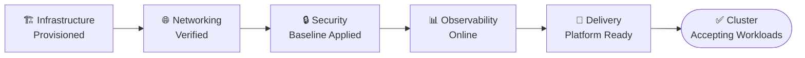
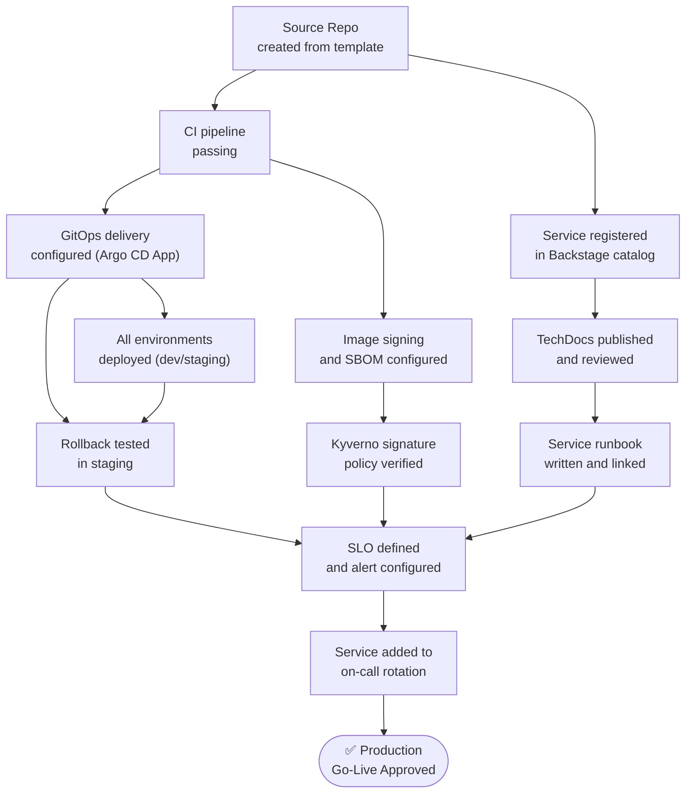

# Platform Engineering Reference Checklists — 2026 Edition
## Operational and Delivery Standards for Platform Teams

> Checklists are gates, not suggestions. Every item exists because someone
> skipped it and paid the price. Do not mark an item complete unless you
> have verified it, not merely assumed it.

---

## Checklist Index

| ID | Title | Scope | When to Use |
|----|-------|-------|-------------|
| CL-001 | New Cluster Readiness | Infrastructure | Before accepting any workloads |
| CL-002 | Service Go-Live (Golden Path) | Delivery | Before a new service reaches production |
| CL-003 | Production Deployment | Delivery | Every production deployment |
| CL-004 | Platform Release | Platform team | Before releasing a platform change |
| CL-005 | Security Baseline | Security | New cluster or quarterly audit |
| CL-006 | Observability Baseline | Observability | Before a service is observable |
| CL-007 | FinOps Readiness | Cost | Before enabling chargeback |
| CL-008 | Incident Readiness | Operations | Quarterly on-call review |
| CL-009 | Disaster Recovery | Operations | Quarterly DR validation |
| CL-010 | AI/ML Platform Readiness | AI/ML | Before GPU workloads go live |

---

## CL-001 — New Cluster Readiness Checklist

**When:** Before any team workloads are scheduled to a new cluster.
**Owner:** Platform engineering team lead.
**Sign-off required from:** Platform lead, security, and on-call manager.

### Progression Gate

---

### 1. Infrastructure

| # | Item | Verified By | Pass/Fail | Notes |
|---|------|-------------|-----------|-------|
| 1.1 | EKS/GKE/AKS cluster provisioned via IaC (not console) | Platform engineer | | Terraform state committed |
| 1.2 | Kubernetes version is current N or N-1 | Platform engineer | | Check `kubectl version` |
| 1.3 | Node groups use IMDSv2 (httpTokens: required) | Platform engineer | | Mitigates SSRF → metadata attacks |
| 1.4 | Node root volumes encrypted with KMS | Platform engineer | | |
| 1.5 | Karpenter installed and NodePool defined | Platform engineer | | At minimum: general + system pools |
| 1.6 | System node group tainted `CriticalAddonsOnly` | Platform engineer | | Prevents workload pods on system nodes |
| 1.7 | Cluster autoscaler disabled (if using Karpenter) | Platform engineer | | Conflict if both active |
| 1.8 | Multi-AZ node distribution verified | Platform engineer | | `kubectl get nodes -o wide` |
| 1.9 | EBS CSI driver installed and IRSA role attached | Platform engineer | | Required for PVC provisioning |
| 1.10 | VPC CNI prefix delegation enabled (EKS) | Platform engineer | | Avoids pod IP exhaustion on large clusters |

---

### 2. Networking

| # | Item | Verified By | Pass/Fail | Notes |
|---|------|-------------|-----------|-------|
| 2.1 | CNI installed and all nodes reporting Ready | Platform engineer | | `kubectl get nodes` |
| 2.2 | DNS resolution working inside cluster | Platform engineer | | `kubectl run dns-test --image=busybox -- nslookup kubernetes.default` |
| 2.3 | Ingress controller installed and healthy | Platform engineer | | Test with a dummy service |
| 2.4 | Default NetworkPolicy (deny-all) applied to workload namespaces | Security | | Allow-list model required |
| 2.5 | TLS termination at ingress verified | Platform engineer | | No HTTP in production |
| 2.6 | Egress restrictions in place (allowlist, not open internet) | Security | | |
| 2.7 | Service mesh installed (if required) and mTLS enabled | Platform engineer | | Cilium / Istio Ambient |
| 2.8 | Load balancer health checks configured correctly | Platform engineer | | |

---

### 3. Security Baseline

| # | Item | Verified By | Pass/Fail | Notes |
|---|------|-------------|-----------|-------|
| 3.1 | Kyverno (or OPA/Gatekeeper) installed with baseline policies | Security | | See CL-005 for full list |
| 3.2 | Pod Security Admission (PSA) enforced at namespace level | Security | | `restricted` profile for workloads |
| 3.3 | RBAC reviewed — no wildcard cluster-admin bindings | Security | | `kubectl get clusterrolebindings` |
| 3.4 | External Secrets Operator installed with IRSA/Workload Identity | Platform engineer | | ClusterSecretStore verified |
| 3.5 | cert-manager installed with ClusterIssuer configured | Platform engineer | | Test cert issuance |
| 3.6 | Secrets encryption at rest enabled (KMS envelope) | Platform engineer | | EKS: encryption config applied |
| 3.7 | Audit logging enabled and shipping to SIEM | Security | | CloudWatch / Splunk / OpenSearch |
| 3.8 | Image pull policy: Never from unapproved registries | Security | | Kyverno policy enforced |
| 3.9 | Falco or Tetragon runtime security deployed | Security | | |
| 3.10 | kube-bench run and CIS benchmark failures remediated | Security | | Critical and High findings only for launch |

---

### 4. Observability

| # | Item | Verified By | Pass/Fail | Notes |
|---|------|-------------|-----------|-------|
| 4.1 | OTel Collector DaemonSet deployed and healthy | Platform engineer | | All nodes covered |
| 4.2 | OTel Collector Gateway deployed (HA, min 3 replicas) | Platform engineer | | |
| 4.3 | Metrics flowing to Mimir/Prometheus | Platform engineer | | Query `up` metric in Grafana |
| 4.4 | Logs flowing to Loki | Platform engineer | | Query `{cluster="<n>"}` in Grafana |
| 4.5 | Traces flowing to Tempo | Platform engineer | | Send test span, verify in Grafana |
| 4.6 | Grafana dashboards: cluster overview, node health, pod health | Platform engineer | | Use community dashboards 315, 17900 as baseline |
| 4.7 | kube-state-metrics and node-exporter deployed | Platform engineer | | |
| 4.8 | Alertmanager configured and routing to PagerDuty/OpsGenie | Platform engineer | | Send test alert — verify receipt |
| 4.9 | Dead man's switch alert active (watchdog) | Platform engineer | | Alerts if monitoring pipeline breaks |
| 4.10 | Alert noise baseline established — no false-positive storms | Platform engineer | | Silence rate < 5% of alerts |

---

### 5. Delivery Platform

| # | Item | Verified By | Pass/Fail | Notes |
|---|------|-------------|-----------|-------|
| 5.1 | Argo CD installed in HA mode (min 2 replicas each component) | Platform engineer | | |
| 5.2 | App of Apps root application bootstrapped | Platform engineer | | All addons managed by GitOps |
| 5.3 | Cluster registered in Argo CD | Platform engineer | | `argocd cluster list` |
| 5.4 | Image updater or CI-driven tag update configured | Platform engineer | | |
| 5.5 | Argo Rollouts installed and AnalysisTemplate tested | Platform engineer | | Run canary on test service |
| 5.6 | Backstage registered this cluster in catalog | Platform engineer | | |
| 5.7 | OpenCost deployed and cost data appearing | Platform engineer | | Allow 24h for data population |

---

### Sign-off

| Role | Name | Date | Signature |
|------|------|------|-----------|
| Platform Team Lead | | | |
| Security Lead | | | |
| On-Call Manager | | | |

---

## CL-002 — Service Go-Live (Golden Path)

**When:** Before a new service is promoted to production for the first time.
**Owner:** Owning team lead + platform engineer.
**This is not a deployment checklist — it is a one-time readiness gate.**

### Dependency Relationships

---

### Code and Repository

| # | Item | Owner | Pass/Fail | Notes |
|---|------|-------|-----------|-------|
| 1.1 | Repository created from approved golden path template | Team lead | | Not a manual copy |
| 1.2 | `catalog-info.yaml` present and registered in Backstage | Team lead | | Owner, lifecycle, links populated |
| 1.3 | `README.md` describes the service, its dependencies, and how to run locally | Team lead | | |
| 1.4 | `CODEOWNERS` file present | Team lead | | At least two owners |
| 1.5 | Renovate or Dependabot configured for dependency updates | Team lead | | |
| 1.6 | Branch protection rules enforced (require PR, CI pass, review) | Platform engineer | | |
| 1.7 | Secrets not committed — secret scanning enabled | Security | | GitHub secret scanning or truffleHog |

---

### CI Pipeline

| # | Item | Owner | Pass/Fail | Notes |
|---|------|-------|-----------|-------|
| 2.1 | CI pipeline derived from golden path workflow (not bespoke) | Team lead | | |
| 2.2 | Lint, unit tests, and SAST run on every PR | Team lead | | All must pass to merge |
| 2.3 | Container image built with Buildkit and pushed to internal registry | Team lead | | |
| 2.4 | SBOM generated (Syft) and attached as OCI attestation | Team lead | | |
| 2.5 | Vulnerability scan (Grype/Trivy) configured — HIGH/CRITICAL blocks | Team lead | | Document any accepted exceptions |
| 2.6 | Image signed with Cosign — keyless or KMS-backed | Team lead | | |
| 2.7 | SLSA provenance attestation attached | Team lead | | Level 2 minimum |
| 2.8 | Image tag update to config repo automated on merge to main | Team lead | | |
| 2.9 | CI runtime: no long-lived credentials — OIDC only | Platform engineer | | |

---

### Delivery and Environments

| # | Item | Owner | Pass/Fail | Notes |
|---|------|-------|-----------|-------|
| 3.1 | Helm chart extends approved golden-path-api or golden-path-worker | Team lead | | No bespoke chart without platform approval |
| 3.2 | Service deployed and healthy in dev environment | Team lead | | |
| 3.3 | Service deployed and healthy in staging environment | Team lead | | |
| 3.4 | Integration tests passing in staging | Team lead | | |
| 3.5 | Rollback tested in staging — timed and documented | Team lead | | Must complete in < 10 min |
| 3.6 | Resource requests and limits set (memory limit mandatory) | Team lead | | See platform defaults |
| 3.7 | HPA configured with appropriate min/max | Team lead | | |
| 3.8 | PodDisruptionBudget configured | Team lead | | minAvailable ≥ 1 |
| 3.9 | Topology spread constraints configured (multi-AZ) | Team lead | | |
| 3.10 | Liveness, readiness, and startup probes configured | Team lead | | Tested under load |
| 3.11 | Graceful shutdown implemented (SIGTERM handler, drainTimeout) | Team lead | | |

---

### Observability

| # | Item | Owner | Pass/Fail | Notes |
|---|------|-------|-----------|-------|
| 4.1 | Service emits metrics via OTel SDK or Prometheus endpoint | Team lead | | |
| 4.2 | ServiceMonitor or OTel annotation configured | Team lead | | |
| 4.3 | Structured logs (JSON) with standard fields (level, trace_id, span_id) | Team lead | | |
| 4.4 | Distributed tracing instrumented (OTel auto or manual) | Team lead | | |
| 4.5 | Grafana dashboard created for service golden signals | Team lead | | Rate, errors, duration, saturation |
| 4.6 | Dashboard linked from Backstage catalog entry | Team lead | | |

---

### SLOs and Alerting

| # | Item | Owner | Pass/Fail | Notes |
|---|------|-------|-----------|-------|
| 5.1 | SLO defined (availability and/or latency) | Team lead + platform | | Agreed with product owner |
| 5.2 | SLO configured in Sloth or Pyrra | Platform engineer | | |
| 5.3 | Error budget burn rate alerts configured | Platform engineer | | Fast burn (1h) and slow burn (6h) |
| 5.4 | Alert routes to correct team channel and PagerDuty | Platform engineer | | Test alert delivery |
| 5.5 | Alert runbook links point to valid, populated runbooks | Team lead | | No dead links |

---

### Security

| # | Item | Owner | Pass/Fail | Notes |
|---|------|-------|-----------|-------|
| 6.1 | Image signature verified by Kyverno policy at admission | Platform engineer | | Deploy and confirm admit |
| 6.2 | Container runs as non-root (`runAsNonRoot: true`) | Team lead | | |
| 6.3 | `readOnlyRootFilesystem: true` | Team lead | | tmpfs mounts for writable paths |
| 6.4 | `allowPrivilegeEscalation: false` | Team lead | | |
| 6.5 | All capabilities dropped | Team lead | | |
| 6.6 | Secrets sourced from ExternalSecret — not hardcoded env vars | Team lead | | |
| 6.7 | NetworkPolicy allows only required ingress/egress | Security | | Validated with `kubectl exec` test |
| 6.8 | IRSA role attached if service needs AWS APIs — least privilege | Platform engineer | | IAM role reviewed by security |
| 6.9 | No secrets in container image layers | Security | | Grype + Syft clean |

---

### Documentation and On-Call

| # | Item | Owner | Pass/Fail | Notes |
|---|------|-------|-----------|-------|
| 7.1 | TechDocs published in Backstage | Team lead | | Architecture, dependencies, data flows |
| 7.2 | Operational runbook written — covers top 3 failure modes | Team lead | | Linked from alert annotations |
| 7.3 | Service added to on-call schedule | On-call manager | | |
| 7.4 | On-call engineer for this service has been briefed | Team lead | | |
| 7.5 | Escalation path documented (L1 → L2 → team lead → engineering manager) | Team lead | | |

---

### Sign-off

| Role | Name | Date | Approved |
|------|------|------|----------|
| Team Lead | | | ☐ |
| Platform Engineer | | | ☐ |
| Security | | | ☐ |
| On-Call Manager | | | ☐ |

---

## CL-003 — Production Deployment Checklist

**When:** Every deployment to production.
**Owner:** Deploying engineer.
**Time required:** 10–15 minutes pre-deployment, 20 minutes post-deployment monitoring.

> This checklist applies to all production deployments, including hotfixes.
> The temptation to skip it is highest precisely when it matters most.

### Pre-Deployment

| # | Item | Done |
|---|------|------|
| 1.1 | CI pipeline is green on the commit being deployed | ☐ |
| 1.2 | Deployment has been validated in staging within the last 24 hours | ☐ |
| 1.3 | Image digest confirmed (not relying on mutable `latest` tag) | ☐ |
| 1.4 | Change is within the deployment window (if change freeze applies) | ☐ |
| 1.5 | Rollback procedure confirmed — what is the previous good image tag? | ☐ |
| 1.6 | DB migration assessed — is it backward-compatible? | ☐ |
| 1.7 | Feature flags assessed — are any being enabled simultaneously? | ☐ |
| 1.8 | On-call engineer notified and available for the deployment window | ☐ |
| 1.9 | Error rate baseline noted — current P50/P99 latency and error % | ☐ |
| 1.10 | Grafana dashboard open and monitoring during deployment | ☐ |

---

### DB Migration Decision Criteria

| Migration Type | Safe to Deploy Simultaneously? | Action Required |
|---------------|-------------------------------|-----------------|
| Add nullable column | ✅ Yes | Deploy freely |
| Add column with default | ✅ Yes | Deploy freely |
| Add index (concurrent) | ✅ Yes | `CREATE INDEX CONCURRENTLY` only |
| Rename column | ❌ No | Two-phase deploy: add new column → dual-write → migrate → remove old |
| Drop column | ❌ No | Remove references in code first, then drop in separate deployment |
| Change column type | ❌ No | Two-phase: add new column, migrate data, cut over |
| Add non-nullable column without default | ❌ No | Always add default or make nullable first |

---

### Deployment Execution

| # | Item | Done |
|---|------|------|
| 2.1 | Config repo updated with new image tag — not `kubectl set image` | ☐ |
| 2.2 | Argo CD sync triggered or confirmed (auto-sync active) | ☐ |
| 2.3 | Canary weight progression monitored (if Argo Rollouts) | ☐ |
| 2.4 | Pod rollout progress verified — no stuck pods | ☐ |
| 2.5 | Old pods terminated cleanly — no 502s during termination | ☐ |

---

### Post-Deployment Monitoring Window (20 minutes minimum)

| Metric | Baseline | Current | Status |
|--------|----------|---------|--------|
| HTTP error rate (5xx) | % | % | |
| P50 response time | ms | ms | |
| P99 response time | ms | ms | |
| Pod restart count | | | |
| Memory usage vs limit | | | |
| CPU usage vs request | | | |

| # | Item | Done |
|---|------|------|
| 3.1 | Error rate stable or improving vs baseline | ☐ |
| 3.2 | Latency stable or improving vs baseline | ☐ |
| 3.3 | No new alerts firing | ☐ |
| 3.4 | No pod CrashLoops or OOMKills | ☐ |
| 3.5 | Log output nominal — no new ERROR patterns | ☐ |
| 3.6 | Downstream services unaffected | ☐ |

---

### Rollback Triggers

Initiate rollback (→ RB-002) immediately if **any** of the following are observed:

| Condition | Threshold | Action |
|-----------|-----------|--------|
| HTTP 5xx error rate | > 1% sustained for 3 min | Rollback |
| HTTP 5xx error rate | > 5% for any 1 min window | Rollback immediately |
| P99 latency increase | > 200% of baseline | Rollback |
| Pod CrashLoopBackOff | Any pod in CrashLoop post-deploy | Investigate → rollback if not resolved in 5 min |
| OOMKill | More than 2 pods OOMKilled | Rollback |
| Downstream error rate increase | > 2% increase attributed to this service | Rollback |

---

## CL-004 — Platform Release Checklist

**When:** Before the platform team releases a change that affects shared infrastructure, addons, or the IDP itself.
**Owner:** Platform team lead.
**Scope:** Applies to Kubernetes version upgrades, Argo CD upgrades, Kyverno policy changes, OTel Collector updates, and similar platform-wide changes.

### Risk Assessment

| Change Type | Risk Level | Minimum Testing Environment | Required Sign-offs |
|------------|------------|----------------------------|-------------------|
| Kubernetes minor version upgrade | High | Staging cluster — full workload test | Platform lead + security |
| Kubernetes patch version | Medium | Staging cluster | Platform lead |
| Argo CD upgrade | Medium | Staging Argo CD instance | Platform lead |
| Kyverno policy — new Enforce rule | High | Audit mode in production first | Platform lead + security |
| Kyverno policy — new Audit rule | Low | Can go direct | Platform lead |
| OTel Collector config change | Medium | Staging cluster | Platform lead |
| Ingress controller upgrade | High | Staging + canary in production | Platform lead |
| cert-manager upgrade | Medium | Staging cluster | Platform lead |
| Helm chart golden path update | High | Test with representative services | Platform lead + one service team |
| Backstage version upgrade | Low–Medium | Staging Backstage instance | Platform lead |

---

### Pre-Release

| # | Item | Done |
|---|------|------|
| 1.1 | Change documented in platform changelog | ☐ |
| 1.2 | Breaking changes explicitly listed with migration guide | ☐ |
| 1.3 | Change tested in non-production environment | ☐ |
| 1.4 | Rollback procedure documented and tested | ☐ |
| 1.5 | Communication sent to engineering teams (minimum 48h notice for breaking changes) | ☐ |
| 1.6 | Platform SLO monitoring active during release window | ☐ |
| 1.7 | Release scheduled outside peak traffic hours | ☐ |
| 1.8 | On-call engineer aware and standing by | ☐ |

---

### Kubernetes Version Upgrade Specifics

| # | Item | Done |
|---|------|------|
| 2.1 | API deprecations identified — `kubectl convert` run against all manifests | ☐ |
| 2.2 | Addon compatibility matrix checked (cert-manager, Kyverno, Argo CD, etc.) | ☐ |
| 2.3 | Control plane upgraded first, then node groups | ☐ |
| 2.4 | Node groups upgraded one at a time with `maxUnavailable: 1` | ☐ |
| 2.5 | All nodes running new version verified | ☐ |
| 2.6 | All addons updated to compatible versions post-upgrade | ☐ |
| 2.7 | PodDisruptionBudgets verified — no workloads blocked during node drain | ☐ |

---

### Kyverno Policy Rollout (Enforce mode)

| # | Item | Done |
|---|------|------|
| 3.1 | Policy deployed in Audit mode minimum 7 days before enforcing | ☐ |
| 3.2 | PolicyReport reviewed — all violations identified and addressed | ☐ |
| 3.3 | Service teams notified of required changes | ☐ |
| 3.4 | Exception process defined and communicated | ☐ |
| 3.5 | Policy switched to Enforce mode with monitoring active | ☐ |
| 3.6 | Argo CD sync health checked post-enforcement | ☐ |

---

### Post-Release

| # | Item | Done |
|---|------|------|
| 4.1 | All platform addon pods healthy post-release | ☐ |
| 4.2 | Representative workloads deployed and functioning | ☐ |
| 4.3 | Observability pipeline verified — data flowing end-to-end | ☐ |
| 4.4 | Backstage catalog refreshed and healthy | ☐ |
| 4.5 | Changelog published to internal platform newsletter / wiki | ☐ |
| 4.6 | Any incidents or near-misses documented | ☐ |

---

## CL-005 — Security Baseline Checklist

**When:** New cluster launch, or quarterly security audit.
**Owner:** Security lead + platform engineer.

### Identity and Access

| # | Item | Severity if Missing | Pass/Fail | Notes |
|---|------|-------------------|-----------|-------|
| 1.1 | No service account with `cluster-admin` binding except break-glass | Critical | | |
| 1.2 | IRSA / Workload Identity used for all cloud API access — no node IAM role overreach | Critical | | |
| 1.3 | OIDC provider configured for human cluster access (SSO, not long-lived kubeconfigs) | High | | |
| 1.4 | Break-glass credentials stored in password manager, not shared Slack | Critical | | |
| 1.5 | `automountServiceAccountToken: false` set on pods that don't need it | Medium | | |
| 1.6 | Service account token projections use `expirationSeconds` < 3600 | Medium | | |

---

### Workload Hardening

| # | Item | Severity if Missing | Pass/Fail | Notes |
|---|------|-------------------|-----------|-------|
| 2.1 | Pod Security Admission: `restricted` enforced on workload namespaces | High | | |
| 2.2 | No privileged containers in workload namespaces | Critical | | Kyverno policy enforced |
| 2.3 | No `hostPID`, `hostNetwork`, `hostIPC` | Critical | | |
| 2.4 | No `hostPath` volumes outside approved platform components | High | | |
| 2.5 | `runAsNonRoot: true` on all workload containers | High | | |
| 2.6 | `readOnlyRootFilesystem: true` on all workload containers | Medium | | |
| 2.7 | All Linux capabilities dropped | High | | |
| 2.8 | Seccomp profile `RuntimeDefault` applied | Medium | | |
| 2.9 | Resource limits set — memory limit mandatory | Medium | | Prevents resource exhaustion attacks |

---

### Supply Chain

| # | Item | Severity if Missing | Pass/Fail | Notes |
|---|------|-------------------|-----------|-------|
| 3.1 | All internal images signed with Cosign | High | | |
| 3.2 | Kyverno policy verifies signatures at admission | Critical | | Test by attempting to deploy unsigned image |
| 3.3 | SBOMs generated for all internal images | Medium | | SPDX or CycloneDX |
| 3.4 | SBOMs stored and queryable (Grype, Dependency Track) | Medium | | |
| 3.5 | Image vulnerability scanning in CI — HIGH blocks build | High | | |
| 3.6 | Base images are distroless or minimal (not `ubuntu:latest`) | Medium | | |
| 3.7 | Renovate/Dependabot auto-PRs active and reviewed weekly | Medium | | |
| 3.8 | SLSA Level 2 provenance on all internal builds | Medium | | |

---

### Network

| # | Item | Severity if Missing | Pass/Fail | Notes |
|---|------|-------------------|-----------|-------|
| 4.1 | Default-deny NetworkPolicy applied to all workload namespaces | High | | |
| 4.2 | Explicit allow-list NetworkPolicies documented and reviewed | High | | |
| 4.3 | Egress restricted — no open internet access from workload pods | High | | |
| 4.4 | mTLS enforced between services (service mesh or Cilium) | Medium | | |
| 4.5 | Ingress TLS minimum TLS 1.2 — TLS 1.0/1.1 disabled | High | | |
| 4.6 | Cluster endpoint not publicly accessible (or restricted to VPN CIDRs) | High | | |

---

### Secrets

| # | Item | Severity if Missing | Pass/Fail | Notes |
|---|------|-------------------|-----------|-------|
| 5.1 | No secrets in ConfigMaps | Critical | | |
| 5.2 | No secrets in environment variables (direct) — all via ExternalSecret | High | | |
| 5.3 | Secrets encrypted at rest (KMS envelope encryption) | High | | |
| 5.4 | Secret access audited — who can read what | High | | |
| 5.5 | Secret rotation schedule defined and tested | Medium | | |
| 5.6 | ESO refresh interval appropriate for secret sensitivity | Medium | | |

---

### Runtime and Audit

| # | Item | Severity if Missing | Pass/Fail | Notes |
|---|------|-------------------|-----------|-------|
| 6.1 | Falco or Tetragon deployed and rules active | High | | |
| 6.2 | Runtime alerts routing to security team | High | | Test with a known-bad rule trigger |
| 6.3 | Kubernetes API audit logs enabled and retained for 90+ days | High | | |
| 6.4 | Audit logs shipping to SIEM | High | | |
| 6.5 | kube-bench CIS Kubernetes Benchmark — no Critical failures | High | | |
| 6.6 | Trivy Operator or Starboard scanning cluster resources continuously | Medium | | |

---

## CL-006 — Observability Baseline Checklist

**When:** Before any service is considered observable in production.
**Owner:** Platform engineer + service team.

### The Four Signals — Minimum Bar

| Signal | Required? | Verification Method |
|--------|-----------|-------------------|
| Request rate | ✅ Mandatory | `rate(http_requests_total[5m])` visible in Grafana |
| Error rate | ✅ Mandatory | `rate(http_requests_total{status=~"5.."}[5m])` visible |
| Latency (P50, P99) | ✅ Mandatory | `histogram_quantile` or OTel span duration in Tempo |
| Saturation (CPU, memory) | ✅ Mandatory | `container_memory_working_set_bytes` and `cpu_usage` visible |

---

### Metrics

| # | Item | Pass/Fail | Notes |
|---|------|-----------|-------|
| 1.1 | Service exposes metrics on `/metrics` or via OTel push | | |
| 1.2 | ServiceMonitor or OTel annotation configured and active | | |
| 1.3 | Metrics visible in Grafana Explore within 60 seconds of pod start | | |
| 1.4 | Business metrics defined and emitted (not just infrastructure metrics) | | |
| 1.5 | Cardinality of custom metrics reviewed — no unbounded label values | | High cardinality kills Prometheus |

---

### Logs

| # | Item | Pass/Fail | Notes |
|---|------|-----------|-------|
| 2.1 | Logs are structured JSON — not free-text | | |
| 2.2 | Standard fields present: `timestamp`, `level`, `message`, `service`, `trace_id`, `span_id` | | |
| 2.3 | Logs visible in Loki within 30 seconds of emission | | |
| 2.4 | Log level is configurable at runtime without restart | | |
| 2.5 | No sensitive data (PII, credentials) in log output | | Security review required |
| 2.6 | Log volume estimated and within Loki retention budget | | |

---

### Traces

| # | Item | Pass/Fail | Notes |
|---|------|-----------|-------|
| 3.1 | OTel SDK integrated (auto or manual instrumentation) | | |
| 3.2 | Traces visible in Tempo for representative requests | | |
| 3.3 | `trace_id` and `span_id` present in logs (log-trace correlation) | | |
| 3.4 | External HTTP calls traced with propagation headers (`traceparent`) | | |
| 3.5 | DB queries traced (OTel DB instrumentation) | | |
| 3.6 | Sampling rate configured appropriately for traffic volume | | 100% in dev, typically 10–20% in production |

---

### Dashboards and Alerting

| # | Item | Pass/Fail | Notes |
|---|------|-----------|-------|
| 4.1 | Grafana dashboard covers all four golden signals | | |
| 4.2 | Dashboard linked from Backstage catalog entry | | |
| 4.3 | SLO alert configured in Sloth/Pyrra | | |
| 4.4 | Fast burn alert (1h window): fires within 5 minutes of budget breach | | |
| 4.5 | Slow burn alert (6h window): catches gradual degradation | | |
| 4.6 | Alert annotations include runbook link | | |
| 4.7 | Dead man's switch alert confirms monitoring pipeline health | | |

---

## CL-007 — FinOps Readiness Checklist

**When:** Before enabling chargeback or showback for engineering teams.
**Owner:** Platform engineer + FinOps lead.

### Cost Attribution Prerequisites

| # | Item | Pass/Fail | Notes |
|---|------|-----------|-------|
| 1.1 | OpenCost deployed and receiving cost data from cloud billing API | | Allow 24h for data |
| 1.2 | All workload namespaces labelled with `platform.example.com/team` | | |
| 1.3 | All workload namespaces labelled with `platform.example.com/cost-centre` | | |
| 1.4 | Kyverno audit policy enforcing label presence | | |
| 1.5 | AWS CUR (Cost & Usage Report) configured and exporting to S3 | | Required for OpenCost cloud cost |
| 1.6 | OpenCost IRSA role attached with `ce:GetCostAndUsage` permission | | |
| 1.7 | Cost data validated — spot vs. on-demand pricing accurate | | Compare with AWS Cost Explorer |

---

### Showback Model Design

| Decision | Options | Chosen | Rationale |
|----------|---------|--------|-----------|
| Attribution unit | Namespace / Team / Service | | |
| Cost split model | Request-based / Limit-based / Actual usage | | Actual usage most accurate |
| Shared cost handling | Proportional / Fixed split / Excluded | | |
| Reporting cadence | Weekly / Monthly | | |
| Report distribution | Grafana dashboard / Email / Slack | | |
| Chargeback vs showback | Showback (informational) / Chargeback (actual billing) | | Start with showback |

---

### Optimisation Checks

| # | Optimisation | Current State | Target | Owner |
|---|-------------|---------------|--------|-------|
| 1 | Spot instance ratio (non-GPU) | % | > 60% | Platform |
| 2 | Average CPU utilisation across nodes | % | 50–70% | Platform |
| 3 | Average memory utilisation across nodes | % | 60–80% | Platform |
| 4 | Oversized pods (request >> actual) | Count | 0 | Service teams |
| 5 | Idle namespaces (no traffic in 7 days) | Count | 0 | Platform |
| 6 | Unattached PVCs | Count | 0 | Platform |
| 7 | NAT Gateway data transfer cost | $ | Benchmarked | Platform |
| 8 | Savings Plan coverage | % | > 70% | FinOps |

---

## CL-008 — Incident Readiness Checklist

**When:** Quarterly review, or when adding a new service to on-call.
**Owner:** On-call manager + platform engineering lead.

### On-Call Programme Health

| # | Item | Last Verified | Pass/Fail | Notes |
|---|------|--------------|-----------|-------|
| 1.1 | All P1 alerts have a documented runbook with working commands | | | |
| 1.2 | All runbook commands tested against current cluster state in last 90 days | | | |
| 1.3 | PagerDuty/OpsGenie escalation policy tested end-to-end | | | |
| 1.4 | On-call rotation has minimum 2 people per week — no single points | | | |
| 1.5 | All on-call engineers have completed at least one shadowed shift | | | |
| 1.6 | Alert noise measured — false positive rate < 10% | | | |
| 1.7 | Mean time to acknowledge (MTTA) < 5 minutes for P1 | | | |
| 1.8 | Mean time to resolve (MTTR) tracked and trending | | | |
| 1.9 | Postmortem completion rate > 90% for P1 incidents | | | |
| 1.10 | Action items from postmortems tracked to completion | | | |

---

### Tooling Access Verification

Every on-call engineer must verify they have working access to all of the following:

| Tool | Access Method | Verified | Notes |
|------|--------------|----------|-------|
| kubectl (production cluster) | SSO + RBAC group | ☐ | Run `kubectl get nodes` |
| Argo CD UI | SSO | ☐ | Can view and sync apps |
| Grafana | SSO | ☐ | Can view all dashboards |
| PagerDuty | Mobile app installed | ☐ | Notifications working |
| AWS Console (read-only) | SSO | ☐ | Can view EC2, RDS, CloudWatch |
| AWS SSM Session Manager | CLI + SSM plugin | ☐ | Can connect to a node |
| argocd CLI | Configured locally | ☐ | `argocd app list` succeeds |
| Incident Slack channels | Joined | ☐ | #incidents, #platform-alerts |

---

### Alert Quality Review

Run quarterly. For each active alert:

| Question | Acceptable Answer |
|----------|------------------|
| Does this alert page someone when it fires? | Yes, via PagerDuty |
| Is the runbook link in the alert annotation valid and up to date? | Yes |
| In the last 90 days, what % of firings were actionable? | > 80% |
| What is the typical time to resolve this alert? | Documented |
| Has this alert ever fired silently (acknowledged but no action)? | No |
| Could this alert be automated away? | If yes, open a ticket |

---

## CL-009 — Disaster Recovery Validation Checklist

**When:** Quarterly. Mandatory before any compliance audit (SOC 2, ISO 27001).
**Owner:** Platform engineering lead + on-call manager.

### Recovery Objectives

| Service Tier | RTO Target | RPO Target | Last Tested | Actual RTO | Pass? |
|-------------|-----------|-----------|-------------|------------|-------|
| Tier 1 (revenue-critical) | < 1 hour | < 15 min | | | |
| Tier 2 (internal tooling) | < 4 hours | < 1 hour | | | |
| Tier 3 (batch / async) | < 24 hours | < 4 hours | | | |

---

### DR Scenarios — Quarterly Test Coverage

| Scenario | Test Method | Frequency | Last Run | Result |
|----------|-------------|-----------|----------|--------|
| Single node failure | Terminate EC2 instance, verify Karpenter replacement | Quarterly | | |
| AZ failure simulation | Cordon all nodes in one AZ, verify traffic redistribution | Quarterly | | |
| Argo CD unavailable | Delete Argo CD namespace, restore from bootstrap, verify sync | Quarterly | | |
| Secrets Manager outage | Disable ESO access, verify graceful degradation | Quarterly | | |
| Config repo unavailable | Disable Argo CD Git access, verify cluster holds state | Quarterly | | |
| Database failover (RDS Multi-AZ) | Force Multi-AZ failover, measure connection recovery time | Quarterly | | |
| Full cluster restore from backup | Restore Etcd snapshot or reprovision cluster from IaC | Annually | | |

---

### Backup Verification

| Asset | Backup Mechanism | Retention | Last Restore Test | Pass? |
|-------|-----------------|-----------|------------------|-------|
| Etcd (EKS managed) | AWS-managed, velero for manifests | 90 days | | |
| Persistent volumes | Velero with volume snapshots | 30 days | | |
| Secrets Manager | AWS managed replication | N/A (service-level) | | |
| Config repository (Git) | GitHub / GitLab redundancy | Indefinite | | |
| Terraform state (S3) | S3 versioning enabled | 90 versions | | |
| Container registry (ECR) | Cross-region replication | 90 days | | |

---

## CL-010 — AI/ML Platform Readiness Checklist

**When:** Before GPU workloads or ML serving goes to production.
**Owner:** Platform engineer + ML platform lead.

### GPU Infrastructure

| # | Item | Pass/Fail | Notes |
|---|------|-----------|-------|
| 1.1 | NVIDIA GPU Operator installed and all GPU nodes report allocatable GPUs | | `kubectl describe node <gpu-node> | grep nvidia` |
| 1.2 | Karpenter GPU NodePool defined with appropriate instance families | | g5, p4d, etc. |
| 1.3 | GPU nodes tainted `nvidia.com/gpu: NoSchedule` | | Only GPU-requesting pods land here |
| 1.4 | GPU time-slicing or MIG configured if sharing is required | | Document sharing policy |
| 1.5 | DCGM Exporter deployed — GPU metrics (utilisation, memory, temperature) in Grafana | | |
| 1.6 | GPU node expiry set shorter than CPU nodes (more frequent patching) | | Recommend 14 days |
| 1.7 | Spot GPU availability acceptable for use case — tested | | Training: spot OK; inference: on-demand preferred |

---

### ML Platform Stack

| # | Item | Pass/Fail | Notes |
|---|------|-----------|-------|
| 2.1 | ML workflow orchestrator deployed (Kubeflow / ZenML / MLflow) | | |
| 2.2 | Experiment tracking backend configured and accessible | | MLflow tracking server |
| 2.3 | Model registry configured | | MLflow or OCI-based |
| 2.4 | Training job resource quotas set per team | | Prevent runaway GPU spend |
| 2.5 | Training jobs emit OTel metrics (GPU utilisation, loss, epoch time) | | |
| 2.6 | GPU cost allocated per team/project via namespace labels + OpenCost | | GPU cost is the dominant line item |

---

### Model Serving

| # | Item | Pass/Fail | Notes |
|---|------|-----------|-------|
| 3.1 | Model serving framework deployed (KServe / vLLM / Ray Serve) | | |
| 3.2 | Model served from registry — not baked into image | | Image pull separate from model weight pull |
| 3.3 | Serving endpoint behind authentication | | Not open to anonymous callers |
| 3.4 | Inference latency SLO defined (P50, P99 token latency for LLMs) | | |
| 3.5 | Auto-scaling configured for inference replicas | | KEDA or KServe HPA |
| 3.6 | Model version rollback tested | | Point to previous model version |
| 3.7 | Token usage and cost per call tracked | | LLMOps observability |
| 3.8 | Guardrails configured (input validation, output filtering) | | |

---

### LLMOps (if serving LLMs)

| # | Item | Pass/Fail | Notes |
|---|------|-----------|-------|
| 4.1 | Prompt templates version-controlled in Git | | Not hardcoded in application code |
| 4.2 | Evaluation pipeline exists — automated regression on prompt changes | | |
| 4.3 | Safety filtering in place (toxicity, PII detection) | | |
| 4.4 | Model output logged (with PII scrubbing) for debugging | | Retention policy defined |
| 4.5 | Rate limiting per caller configured | | Prevents cost overruns from runaway consumers |
| 4.6 | Fallback configured if primary model unavailable | | Smaller model or graceful error |
| 4.7 | GPU spend anomaly alert configured | | Sudden 10x spend increase = alert |

---

## Checklist Governance

### Ownership and Review Cycle

| Checklist | Review Cadence | Owner | Last Reviewed |
|-----------|---------------|-------|---------------|
| CL-001 New Cluster Readiness | Per cluster + annually | Platform lead | |
| CL-002 Service Go-Live | Per service | Platform lead | |
| CL-003 Production Deployment | Per deployment | Service team | |
| CL-004 Platform Release | Per release | Platform lead | |
| CL-005 Security Baseline | Quarterly | Security lead | |
| CL-006 Observability Baseline | Per service + quarterly | Platform lead | |
| CL-007 FinOps Readiness | Quarterly | FinOps lead | |
| CL-008 Incident Readiness | Quarterly | On-call manager | |
| CL-009 DR Validation | Quarterly | Platform lead | |
| CL-010 AI/ML Readiness | Per GPU cluster | ML platform lead | |

### Checklist Failure Policy

| Scenario | Policy |
|----------|--------|
| Go-live checklist item fails | Deployment blocked until resolved or exception granted |
| Exception granted | Documented in checklist, risk accepted by team lead, remediation ticket raised |
| Security item fails | Escalated to security lead — no exception without security sign-off |
| Checklist item is not applicable | Mark N/A with reason — cannot leave blank |
| Checklist not completed before deployment | Deployment reverted post-facto or flagged as policy violation |

---

*Checklists are owned by the platform team but executed by those doing the work. A checklist that lives only in a wiki and is never enforced is decoration. Gate your pipelines, your Backstage scaffolder outputs, and your deployment workflows on checklist completion where possible — the best compliance is the kind engineers don't have to think about.*

*Three structural choices worth noting: the DB migration decision criteria table in CL-003 (which most orgs get wrong and pay for in outages), the rollback trigger thresholds table with explicit numbers, and the checklist failure policy at the end — which addresses the meta-problem that most checklist programmes fail on: what actually happens when something doesn't pass.*