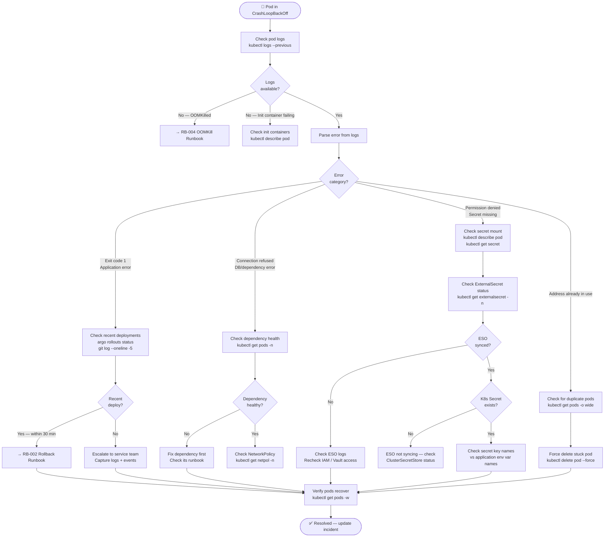
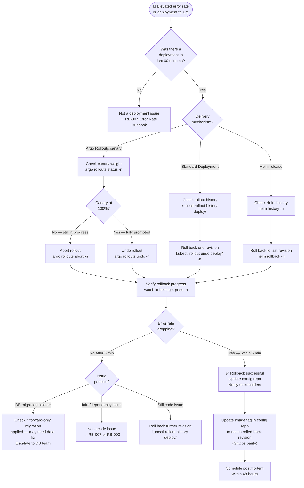
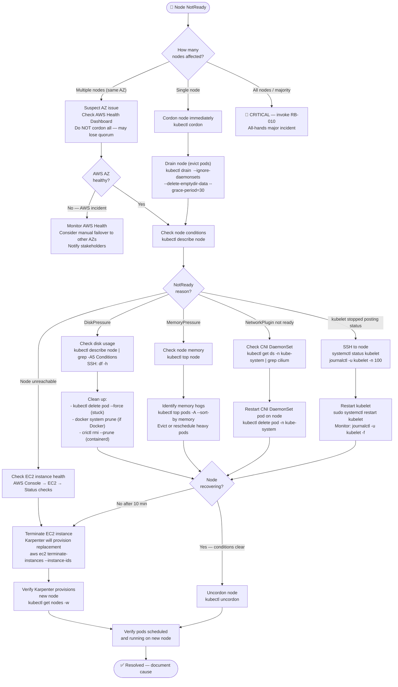
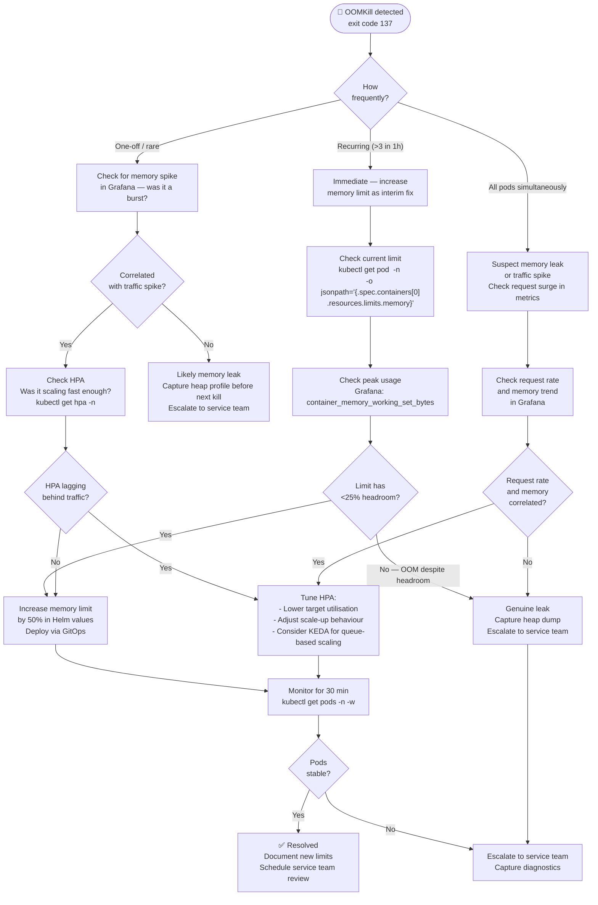
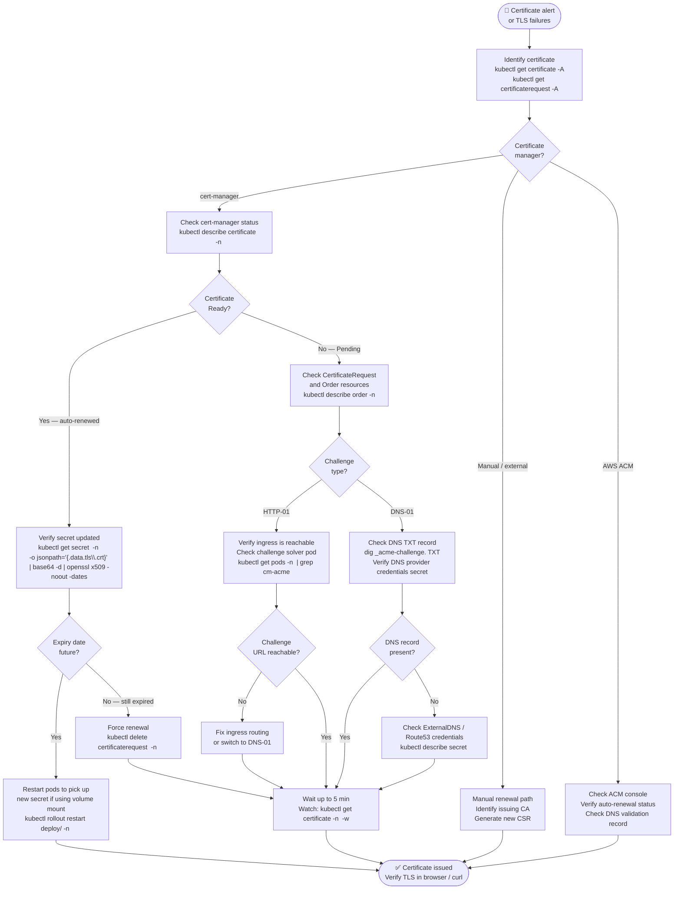
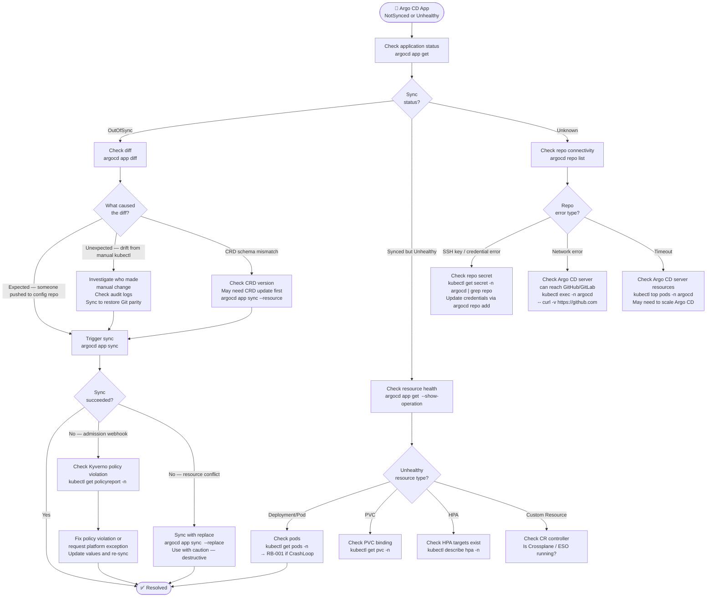
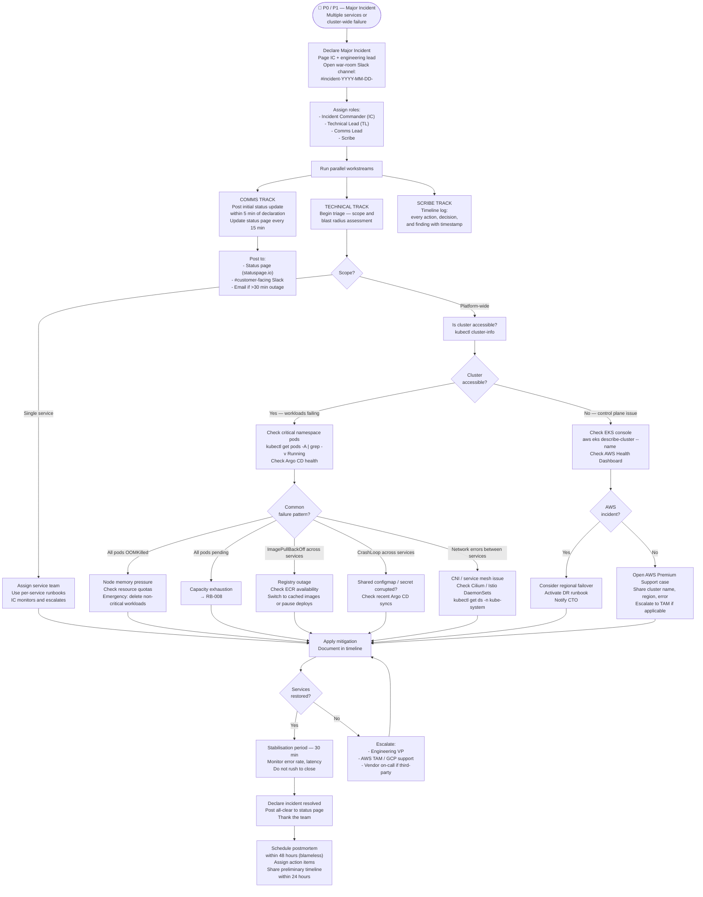

# Platform Engineering Runbooks — 2026 Edition

## Operational Reference for Platform Engineers and On-Call SREs

> These runbooks are living documents. Every procedure here should be executed,
> validated, and updated quarterly. A runbook that has never been tested in anger
> is a liability, not an asset.

---

## Runbook Index

| ID | Title | Severity | Avg Resolution Time |
|----|-------|----------|-------------------|
| RB-001 | Pod CrashLoopBackOff Investigation | P2–P3 | 15–30 min |
| RB-002 | Deployment Rollback (Argo Rollouts / standard) | P1–P2 | 5–15 min |
| RB-003 | Node Not Ready — Investigation and Recovery | P1–P2 | 20–45 min |
| RB-004 | OOMKill Triage and Remediation | P2–P3 | 20–40 min |
| RB-005 | Certificate Expiry — Detection and Renewal | P1 | 10–20 min |
| RB-006 | Argo CD Sync Failure Investigation | P2–P3 | 15–30 min |
| RB-007 | High Error Rate — Service Triage and Escalation | P1 | 10–25 min |
| RB-008 | Cluster Capacity Exhaustion | P1 | 15–30 min |
| RB-009 | Secret Rotation — Emergency Procedure | P1–P2 | 20–40 min |
| RB-010 | Major Incident — Full Escalation Workflow | P0–P1 | ongoing |

---

## RB-001 — Pod CrashLoopBackOff Investigation

**Trigger:** Alert `KubePodCrashLooping` fires, or developer reports service unavailable.
**Severity:** P2–P3 depending on blast radius.
**Owner:** On-call platform engineer / owning team.

### Decision Flow



### Step-by-Step Procedure

**Step 1 — Identify affected pods**

```bash
# Identify CrashLooping pods across all namespaces
kubectl get pods -A | grep -E "CrashLoop|Error|OOMKilled"

# Get detailed status for a specific pod
kubectl describe pod <pod-name> -n <namespace>

# Check exit code — critical for triage
kubectl get pod <pod-name> -n <namespace> \
  -o jsonpath='{.status.containerStatuses[0].lastState.terminated.exitCode}'
```

Common exit codes:
- `0` — clean exit (misconfigured liveness probe)
- `1` — application error (check logs)
- `137` — OOMKilled (→ RB-004)
- `139` — segfault
- `143` — SIGTERM not handled (graceful shutdown issue)

**Step 2 — Retrieve logs**

```bash
# Current container logs
kubectl logs <pod-name> -n <namespace>

# Previous container logs (the crashed instance)
kubectl logs <pod-name> -n <namespace> --previous

# If multi-container pod
kubectl logs <pod-name> -n <namespace> -c <container-name> --previous

# Tail logs in real time while pod restarts
kubectl logs -f <pod-name> -n <namespace> --previous=false
```

**Step 3 — Check events**

```bash
# Events are cleared after 1 hour by default — check immediately
kubectl get events -n <namespace> \
  --sort-by='.lastTimestamp' \
  --field-selector involvedObject.name=<pod-name>

# Cluster-wide recent warnings
kubectl get events -A --field-selector type=Warning \
  --sort-by='.lastTimestamp' | tail -30
```

**Step 4 — Check secret and configmap mounts**

```bash
# Verify ExternalSecret sync status
kubectl get externalsecret -n <namespace>
kubectl describe externalsecret <name> -n <namespace>

# Verify the resulting K8s Secret exists and has expected keys
kubectl get secret <secret-name> -n <namespace> \
  -o jsonpath='{.data}' | jq 'keys'

# Check if pod can actually see the secret
kubectl exec -it <pod-name> -n <namespace> -- env | grep -E "DB_|API_"
```

**Step 5 — Verify and monitor recovery**

```bash
# Watch pod status
kubectl get pods -n <namespace> -w

# Check restart count trend
kubectl get pod <pod-name> -n <namespace> \
  -o jsonpath='{.status.containerStatuses[0].restartCount}'
```

**Escalation threshold:** If not resolved within 30 minutes, escalate to service team owner. If service is P1 and rollback is not resolving, invoke RB-010.

---

## RB-002 — Deployment Rollback

**Trigger:** Elevated error rate post-deployment, P1/P2 alert, or explicit rollback request.
**Severity:** P1–P2.
**Owner:** On-call engineer. Service team lead must be notified.
**Time target:** Rollback complete within 10 minutes of decision.

### Rollback Decision Flow



### Step-by-Step Procedure

**Step 1 — Establish blast radius**

```bash
# Check current error rate in Grafana, or:
kubectl top pods -n <namespace>

# Check how far the rollout has progressed
kubectl get deployment <name> -n <namespace> \
  -o jsonpath='{.status.updatedReplicas}/{.status.replicas}'

# If using Argo Rollouts — check canary weight
argo rollouts status <rollout-name> -n <namespace>
argo rollouts get rollout <rollout-name> -n <namespace>
```

**Step 2a — Rollback via Argo Rollouts (canary still in progress)**

```bash
# Abort the in-progress canary — traffic returns to stable immediately
argo rollouts abort <rollout-name> -n <namespace>

# Confirm stable replicas are healthy
argo rollouts get rollout <rollout-name> -n <namespace> --watch
```

**Step 2b — Rollback via Argo Rollouts (fully promoted)**

```bash
# Undo to previous stable revision
argo rollouts undo <rollout-name> -n <namespace>

# Watch new rollout progress
argo rollouts get rollout <rollout-name> -n <namespace> --watch
```

**Step 2c — Rollback standard Kubernetes Deployment**

```bash
# View revision history
kubectl rollout history deployment/<name> -n <namespace>

# Roll back one revision
kubectl rollout undo deployment/<name> -n <namespace>

# Roll back to a specific revision
kubectl rollout undo deployment/<name> -n <namespace> --to-revision=3

# Monitor
kubectl rollout status deployment/<name> -n <namespace>
```

**Step 2d — Rollback Helm release**

```bash
# List release history
helm history <release-name> -n <namespace>

# Roll back to previous revision
helm rollback <release-name> -n <namespace>

# Roll back to specific revision
helm rollback <release-name> 4 -n <namespace>

# Verify
helm status <release-name> -n <namespace>
kubectl get pods -n <namespace> -w
```

**Step 3 — Restore GitOps parity (critical — do not skip)**

After a `kubectl rollout undo` or `helm rollback`, the cluster state has diverged from Git. Argo CD will flag this as OutOfSync and may re-apply the broken version on next sync. **Freeze sync immediately:**

```bash
# Disable auto-sync on the Application while you fix the config repo
argocd app set <app-name> --sync-policy none

# Alternatively, suspend via the Argo CD UI:
# Applications → <app> → App Details → Sync Policy → Disable
```

Then update the config repo:

```bash
# In your platform-config repo
cd apps/<service-name>/values/production/
yq e -i '.image.tag = "<previous-good-tag>"' values.yaml
git add .
git commit -m "fix(deploy): revert <service> to <previous-good-tag>

Rollback initiated due to elevated error rate post-deploy.
Original deploy tag: <bad-tag>
Incident: INC-XXXX"
git push

# Re-enable auto-sync after config repo is updated
argocd app set <app-name> --sync-policy automated
argocd app sync <app-name>
```

---

## RB-003 — Node Not Ready

**Trigger:** Alert `KubeNodeNotReady` fires.
**Severity:** P1 if multiple nodes, P2 if single node with headroom.
**Owner:** Platform engineer on-call.

### Node Recovery Decision Flow



### Step-by-Step Procedure

**Step 1 — Assess and cordon**

```bash
# Overview of all nodes
kubectl get nodes -o wide

# Cordon affected node to prevent new scheduling
kubectl cordon <node-name>

# Check what's running on the node
kubectl get pods -A -o wide | grep <node-name>

# Check node conditions in detail
kubectl describe node <node-name> | grep -A 20 "Conditions:"
```

**Step 2 — Drain (if safe)**

```bash
# Drain — gracefully evicts all pods (except DaemonSets)
# Add --dry-run=client first to preview
kubectl drain <node-name> \
  --ignore-daemonsets \
  --delete-emptydir-data \
  --grace-period=30 \
  --dry-run=client

# Execute drain
kubectl drain <node-name> \
  --ignore-daemonsets \
  --delete-emptydir-data \
  --grace-period=30

# If drain hangs (pod with no owner), force:
kubectl drain <node-name> \
  --ignore-daemonsets \
  --delete-emptydir-data \
  --force
```

**Step 3 — Investigate root cause**

```bash
# SSH to node (via SSM — no bastion needed with SSM Agent)
aws ssm start-session --target <instance-id>

# On the node:
systemctl status kubelet
journalctl -u kubelet -n 200 --no-pager
df -h                          # check disk
free -h                        # check memory
systemctl status containerd    # check container runtime
```

**Step 4 — Terminate and replace (Karpenter)**

```bash
# Get EC2 instance ID from node
kubectl get node <node-name> \
  -o jsonpath='{.spec.providerID}' | cut -d'/' -f5

# Terminate — Karpenter will provision a replacement
aws ec2 terminate-instances --instance-ids <instance-id>

# Watch Karpenter provision new node
kubectl get nodes -w
kubectl get nodeclaims -w   # Karpenter v1.0+ API
```

---

## RB-004 — OOMKill Triage and Remediation

**Trigger:** Alert `KubeContainerOOMKilled` or exit code 137 observed.
**Severity:** P2–P3 (P1 if causing sustained unavailability).

### OOM Decision Flow



### Commands

```bash
# Find OOMKilled pods
kubectl get pods -A -o json | jq -r '
  .items[] |
  select(.status.containerStatuses[]?.lastState.terminated.reason == "OOMKilled") |
  "\(.metadata.namespace)/\(.metadata.name)"'

# Check memory usage vs limit (requires metrics-server)
kubectl top pods -n <namespace> --sort-by=memory

# Get current memory limit for a pod
kubectl get pod <pod-name> -n <namespace> \
  -o jsonpath='{.spec.containers[0].resources.limits.memory}'

# Query peak memory in Prometheus / Mimir (via port-forward)
# max_over_time(
#   container_memory_working_set_bytes{
#     namespace="<ns>",container="<name>"
#   }[24h]
# )

# Update memory limit in Helm values (then commit and push)
yq e -i '.resources.limits.memory = "1Gi"' \
  apps/<service>/values/production/values.yaml
```

---

## RB-005 — Certificate Expiry

**Trigger:** Alert `CertificateExpiryWarning` (<30 days), `CertificateExpiryCritical` (<7 days), or TLS handshake failures.
**Severity:** P1 if expired. P2 if <7 days. P3 if <30 days.

### Certificate Recovery Flow



### Commands

```bash
# List all certificates and their status
kubectl get certificate -A
kubectl get certificaterequest -A

# Check certificate details (Ready, expiry, issuer)
kubectl describe certificate <cert-name> -n <namespace>

# Check the actual TLS secret expiry
kubectl get secret <tls-secret-name> -n <namespace> \
  -o jsonpath='{.data.tls\.crt}' | \
  base64 -d | \
  openssl x509 -noout -dates -subject -issuer

# Check certificate via curl
curl -vI https://<your-domain> 2>&1 | grep -E "expire|issuer|subject"

# Force cert-manager to re-issue (delete the CertificateRequest)
kubectl delete certificaterequest \
  $(kubectl get certificaterequest -n <ns> \
    -o jsonpath='{.items[0].metadata.name}') \
  -n <namespace>

# Watch cert-manager logs for renewal activity
kubectl logs -n cert-manager \
  -l app=cert-manager \
  --since=10m -f | grep -E "cert|order|challenge"

# Check ACME challenge solver pods
kubectl get pods -A | grep cm-acme
kubectl describe pod <cm-acme-pod> -n <namespace>
```

---

## RB-006 — Argo CD Sync Failure

**Trigger:** Alert `ArgoCDAppNotSynced` or `ArgoCDAppUnhealthy`. Developer reports deployment not reflecting their push.
**Severity:** P2–P3.

### Sync Failure Decision Flow



### Commands

```bash
# Check all applications status
argocd app list

# Get detailed status for one app
argocd app get <app-name>

# See what's out of sync
argocd app diff <app-name>

# Manually trigger sync
argocd app sync <app-name>

# Sync specific resource only
argocd app sync <app-name> \
  --resource apps:Deployment:<deployment-name>

# Check sync operation result
argocd app get <app-name> --show-operation

# Refresh (re-fetch from Git without syncing)
argocd app get <app-name> --refresh

# Check for Kyverno policy violations blocking sync
kubectl get policyreport -n <namespace>
kubectl describe policyreport -n <namespace>

# Check Argo CD application controller logs
kubectl logs -n argocd \
  -l app.kubernetes.io/name=argocd-application-controller \
  --since=15m | grep -E "error|failed|<app-name>"

# Re-add a repository credential (if auth failure)
argocd repo add https://github.com/my-org/platform-config.git \
  --username git \
  --password <token>
```

---

## RB-007 — High Error Rate — Service Triage

**Trigger:** Alert `HighErrorRateCritical` (error rate >5% for 5 min), PagerDuty page.
**Severity:** P1.
**Time to first action:** < 5 minutes.

### Error Rate Triage Flow

```mermaid
flowchart TD
    PAGE(["🔴 P1 — High Error Rate\n>5% for 5+ minutes"]) --> ACK["Acknowledge alert\nJoin incident Slack channel\nAssign incident commander"]

    ACK --> SCOPE["Determine scope\n- Which service(s)?\n- Which endpoints?\n- What % of traffic?"]

    SCOPE --> BLAST{Blast\nradius?}
    BLAST -->|"Single service"| SINGLE_SVC["Single service issue\nCheck recent deployments"]
    BLAST -->|"Multiple services, same domain"| SHARED_DEP["Shared dependency issue\nCheck: DB, cache, auth service, API gateway"]
    BLAST -->|"All services"| PLATFORM["Platform-wide issue\n→ RB-010 Major Incident\nCheck: ingress, DNS, cluster health"]

    SINGLE_SVC --> RECENT_DEPLOY{Deployment\nin last hour?}
    RECENT_DEPLOY -->|Yes| ROLLBACK_Q{Error rate\n>10%?}
    ROLLBACK_Q -->|Yes — rollback immediately| ROLLBACK["→ RB-002 Rollback Runbook\nDo not wait for root cause"]
    ROLLBACK_Q -->|No — monitor| GATHER["Gather more data\nIs it trending up or stabilising?"]
    RECENT_DEPLOY -->|No| CHECK_INFRA["Check infra:\n- DB connections\n- Memory/CPU\n- Dependency health"]

    SHARED_DEP --> ID_DEP["Identify failing dependency\nCheck service-to-service\nerror traces in Tempo"]
    ID_DEP --> DEP_TYPE{Dependency\ntype?}
    DEP_TYPE -->|Database| DB_CHECK["Check RDS:\n- Connection pool exhausted?\n- Replication lag?\n- CPU/storage?"]
    DEP_TYPE -->|Cache (Redis)| CACHE_CHECK["Check ElastiCache:\n- Memory usage\n- Eviction rate\n- Connection count"]
    DEP_TYPE -->|External API| EXT_CHECK["Check external API status page\nImplement circuit breaker if not present\nFail gracefully"]
    DEP_TYPE -->|Internal service| INT_CHECK["Triage that service\nFollow this runbook recursively"]

    DB_CHECK --> DB_ACTION{DB\nstate?}
    DB_ACTION -->|"Connection pool full"| POOL_FIX["Scale service replicas down temporarily\nor increase pool size via parameter group"]
    DB_ACTION -->|"High CPU / slow queries"| SLOW_Q["Identify slow queries\nAWS RDS Performance Insights\nKill blocking queries if safe"]
    DB_ACTION -->|"Replication lag"| REP_LAG["Switch reads to primary temporarily\nAlert DB team"]

    GATHER --> STABILISE{Stabilising?}
    STABILISE -->|Yes| MONITOR_ONLY["Continue monitoring\n30 min window\nDo not rollback yet"]
    STABILISE -->|No — worsening| ROLLBACK

    ROLLBACK --> VERIFY_RECOVERY["Verify error rate dropping\nin Grafana within 5 min"]
    POOL_FIX --> VERIFY_RECOVERY
    SLOW_Q --> VERIFY_RECOVERY
    CACHE_CHECK --> VERIFY_RECOVERY
    EXT_CHECK --> VERIFY_RECOVERY

    VERIFY_RECOVERY --> RECOVERED{Error rate\n< 1%?}
    RECOVERED -->|Yes| RESOLVED(["✅ Resolved\nBegin postmortem prep"])
    RECOVERED -->|No after 15 min| ESCALATE["→ RB-010 Major Incident\nEscalate to engineering leadership"]
```

### Commands

```bash
# Quick error rate check (Prometheus query)
# Run via Grafana Explore or port-forward to Mimir:
# sum(rate(http_requests_total{status=~"5.."}[5m])) by (service)
# /
# sum(rate(http_requests_total[5m])) by (service)

# Check pod logs for errors (last 5 minutes)
kubectl logs -n <namespace> \
  -l app.kubernetes.io/name=<service> \
  --since=5m | grep -E "ERROR|FATAL|panic" | tail -50

# Check pod restart counts (surge indicates crash loop)
kubectl get pods -n <namespace> \
  -o custom-columns='NAME:.metadata.name,RESTARTS:.status.containerStatuses[0].restartCount,STATUS:.status.phase'

# Check database connection pool (postgres — via psql)
kubectl exec -it <postgres-pod> -n <ns> -- \
  psql -U postgres -c "SELECT count(*), state FROM pg_stat_activity GROUP BY state;"

# Port-forward to Grafana for dashboard access
kubectl port-forward -n monitoring svc/grafana 3000:80

# Check traces in Tempo for error distribution
# (Use Grafana Explore → Tempo datasource → filter by status=error)

# Check ingress logs for upstream errors
kubectl logs -n ingress-nginx \
  -l app.kubernetes.io/name=ingress-nginx \
  --since=10m | grep " 5[0-9][0-9] " | head -30
```

---

## RB-008 — Cluster Capacity Exhaustion

**Trigger:** Alert `KubeNodeResourcePressure`, pods stuck in `Pending`, or Karpenter failing to provision.
**Severity:** P1 if new pods cannot be scheduled. P2 if existing workloads stable.

### Capacity Decision Flow

```mermaid
flowchart TD
    ALERT(["🔴 Pods Pending\nor capacity alert"]) --> PENDING_REASON["Check why pods are pending\nkubectl describe pod <pending-pod> -n <ns>\nLook for: Events → FailedScheduling"]

    PENDING_REASON --> REASON{Scheduling\nfailure reason?}

    REASON -->|"Insufficient cpu/memory"| COMPUTE["Compute exhausted\nIs Karpenter provisioning?"]
    REASON -->|"No nodes match node selector"| SELECTOR["Node selector / affinity mismatch\nCheck nodeSelector and tolerations"]
    REASON -->|"PVC not bound"| STORAGE["Storage issue → check PVC\nkubectl get pvc -n <ns>"]
    REASON -->|"Too many pods on node"| POD_LIMIT["EKS pod limit per node\nCheck ENI/IP limits\nConsider larger instances or prefix delegation"]

    COMPUTE --> KARPENTER_STATUS["Check Karpenter\nkubectl get nodeclaims\nkubectl logs -n karpenter -l app=karpenter"]

    KARPENTER_STATUS --> KARP_PROVISIONING{Karpenter\nprovisioning?}
    KARP_PROVISIONING -->|"Yes — nodes coming up"| WAIT_NODES["Wait 2–3 min\nkubectl get nodes -w"]
    KARP_PROVISIONING -->|"No — errors in logs"| KARP_ERROR{Error\ntype?}

    KARP_ERROR -->|"Instance type unavailable (spot)"| SPOT_ISSUE["Spot capacity constraint\nCheck NodePool instance families\nAdd more instance type options"]
    KARP_ERROR -->|"IAM/permissions error"| IAM_ERR["Check Karpenter IRSA role\nkubectl describe sa karpenter -n karpenter"]
    KARP_ERROR -->|"vCPU service quota"| QUOTA_ERR["Request quota increase\nAWS Console → Service Quotas\nImmediate: switch to smaller instances"]
    KARP_ERROR -->|"NodePool limit reached"| LIMIT_ERR["Increase NodePool CPU/memory limit\nkubectl edit nodepool general"]

    SPOT_ISSUE --> ADD_INSTANCES["Add instance families to NodePool\nkubectl edit nodepool general"]
    ADD_INSTANCES --> WAIT_NODES

    QUOTA_ERR --> ON_DEMAND["Switch Karpenter to on-demand\ntemporarily\nEdit NodePool capacity-type"]
    ON_DEMAND --> WAIT_NODES

    LIMIT_ERR --> RAISE_LIMIT["Raise limit — confirm with\nfinance/FinOps first\nkubectl patch nodepool general\n--type merge -p '{\"spec\":{\"limits\":{\"cpu\":\"2000\"}}}'"]
    RAISE_LIMIT --> WAIT_NODES

    WAIT_NODES --> NODES_READY{New nodes\njoined?}
    NODES_READY -->|Yes| PODS_SCHEDULED{Pods\nscheduled?}
    NODES_READY -->|No after 5 min| KARP_ERROR

    PODS_SCHEDULED -->|Yes| RESOLVED(["✅ Resolved\nReview capacity limits"])
    PODS_SCHEDULED -->|No| SELECTOR

    SELECTOR --> FIX_SELECTOR["Fix nodeSelector or affinity\nin Helm values\nRedeploy via GitOps"]
    FIX_SELECTOR --> RESOLVED
    STORAGE --> FIX_PVC["Check StorageClass\nkubectl describe pvc <name> -n <ns>\nCheck EBS CSI driver logs"]
    FIX_PVC --> RESOLVED
```

### Commands

```bash
# Find all Pending pods
kubectl get pods -A | grep Pending

# Check why a specific pod is pending
kubectl describe pod <pod-name> -n <namespace> | grep -A 20 Events

# Check Karpenter node provisioning
kubectl get nodeclaims -w
kubectl get nodepools
kubectl describe nodepool general

# Check Karpenter logs for errors
kubectl logs -n karpenter \
  -l app.kubernetes.io/name=karpenter \
  --since=10m | grep -E "error|failed|provisioning"

# Check current node capacity
kubectl describe nodes | grep -E "Allocatable|Allocated" -A 5

# Check EC2 vCPU quotas
aws service-quotas get-service-quota \
  --service-code ec2 \
  --quota-code L-1216C47A    # Running On-Demand Standard instances

# Temporarily raise NodePool limit (confirm with FinOps first)
kubectl patch nodepool general \
  --type merge \
  -p '{"spec":{"limits":{"cpu":"2000","memory":"8000Gi"}}}'

# Check pod topology spread to diagnose unschedulable pods
kubectl get pod <pod-name> -n <namespace> \
  -o jsonpath='{.spec.topologySpreadConstraints}'
```

---

## RB-009 — Emergency Secret Rotation

**Trigger:** Suspected credential leak, security alert, or mandated rotation.
**Severity:** P1.
**Owner:** Platform engineer + security team.
**Note:** Coordinate with service team before rotating — blind rotation causes outages.

### Secret Rotation Flow

```mermaid
flowchart TD
    TRIGGER(["🔴 Credential compromise\nsuspected or confirmed"]) --> ASSESS["Assess scope\n- Which secret(s)?\n- What access do they grant?\n- Evidence of misuse in audit logs?"]

    ASSESS --> MISUSE{Evidence of\nactive misuse?}
    MISUSE -->|Yes — actively exploited| REVOKE_NOW["REVOKE IMMEDIATELY\nDo not wait for rotation plan\nAccept brief outage if needed"]
    MISUSE -->|No — precautionary| PLAN["Plan rotation\nCoordinate with service team\nPrepare new credentials first"]

    REVOKE_NOW --> NOTIFY_SECURITY["Notify security team\nand CISO immediately\nBegin incident response\n→ RB-010"]

    PLAN --> SECRET_TYPE{Secret\ntype?}
    SECRET_TYPE -->|Database credentials| DB_ROTATE["Generate new DB user/password\nin RDS / via DBA team"]
    SECRET_TYPE -->|API key (third party)| API_ROTATE["Rotate in provider dashboard\nDownload new key"]
    SECRET_TYPE -->|TLS certificate| CERT_ROTATE["→ RB-005 Certificate Runbook"]
    SECRET_TYPE -->|AWS IAM key| IAM_ROTATE["Create new IAM key\nDo NOT delete old key yet"]
    SECRET_TYPE -->|Webhook secret| WEBHOOK_ROTATE["Generate new secret\nUpdate in provider first"]

    DB_ROTATE --> UPDATE_SM["Update secret in\nAWS Secrets Manager\naws secretsmanager update-secret"]
    API_ROTATE --> UPDATE_SM
    IAM_ROTATE --> UPDATE_SM
    WEBHOOK_ROTATE --> UPDATE_SM

    UPDATE_SM --> WAIT_ESO["Wait for ESO to sync\n(up to refreshInterval — default 1h)\nForce sync if urgent:\nkubectl annotate externalsecret <name>\nforce-sync=$(date +%s)"]

    WAIT_ESO --> VERIFY_SECRET["Verify K8s Secret updated\nkubectl get secret <name> -n <ns>\n-o jsonpath='{.metadata.resourceVersion}'"]

    VERIFY_SECRET --> RESTART_PODS["Rolling restart to pick up new secret\nkubectl rollout restart deploy/<name> -n <ns>"]

    RESTART_PODS --> VERIFY_APP["Verify application\nfunctioning correctly\nCheck error rate in Grafana"]

    VERIFY_APP --> APP_OK{Application\nhealthy?}
    APP_OK -->|Yes| REVOKE_OLD["Revoke / delete old credentials\nin provider / AWS console"]
    APP_OK -->|No| ROLLBACK_SECRET["Something wrong with new secret\nCheck format / permissions\nRestore old secret temporarily"]

    REVOKE_OLD --> AUDIT["Review audit logs for\nunauthorised usage of old credential\nDocument timeline"]
    ROLLBACK_SECRET --> DEBUG["Debug new credential\nCheck IAM permissions\nCheck secret format"]
    Debug --> UPDATE_SM

    AUDIT --> RESOLVED(["✅ Rotation complete\nDocument in incident log"])
    NOTIFY_SECURITY --> REVOKE_NOW_ACTION["Invalidate credential\nin provider immediately"]
    REVOKE_NOW_ACTION --> UPDATE_SM
```

### Commands

```bash
# Check what secrets ESO is managing
kubectl get externalsecret -A

# Force ESO to re-sync immediately (without waiting for refresh interval)
kubectl annotate externalsecret <secret-name> -n <namespace> \
  force-sync="$(date +%s)" --overwrite

# Update a secret in AWS Secrets Manager
aws secretsmanager update-secret \
  --secret-id "production/my-service/db-credentials" \
  --secret-string '{"username":"myuser","password":"<new-password>","host":"...","port":"5432","dbname":"mydb"}'

# Verify the K8s secret was updated (check resourceVersion changed)
kubectl get secret <k8s-secret-name> -n <namespace> \
  -o jsonpath='{.metadata.resourceVersion}'

# Trigger rolling restart to pick up new secret
kubectl rollout restart deployment/<name> -n <namespace>
kubectl rollout status deployment/<name> -n <namespace>

# Check CloudTrail for credential usage (requires AWS CLI)
aws cloudtrail lookup-events \
  --lookup-attributes AttributeKey=AccessKeyId,AttributeValue=<old-key-id> \
  --start-time $(date -d '24 hours ago' --iso-8601=seconds) \
  --query 'Events[].{Time:EventTime,Name:EventName,Source:EventSource,IP:CloudTrailEvent}' \
  --output table
```

---

## RB-010 — Major Incident — Full Escalation Workflow

**Trigger:** P0/P1 — multiple services down, data loss risk, security breach, cluster-wide failure.
**Severity:** P0–P1.
**Owner:** Incident Commander (IC). All hands.

### Major Incident Escalation Flow



### Incident Command Checklist

**First 5 minutes:**
```
□ Acknowledge alert and join #incidents channel
□ Declare incident severity (P0/P1)
□ Create war-room: #incident-YYYY-MM-DD-description
□ Assign IC, TL, Comms Lead, Scribe
□ Post initial status page update
□ Start timeline document (shared doc or in-channel thread)
```

**First 15 minutes:**
```
□ Assess blast radius — which customers/services affected
□ Establish what is known vs unknown
□ Make first decision: mitigate fast (rollback/failover) or diagnose first
□ Communicate ETA to stakeholders (even if "unknown — investigating")
□ Brief engineering leadership
```

**Every 15 minutes:**
```
□ Update status page
□ Share findings in war-room (what we know, what we're trying, what's next)
□ Re-assess severity — is it worsening or stabilising?
□ Confirm all team members have clear tasks
```

### Key Commands for Major Incident Triage

```bash
# Cluster health overview
kubectl get nodes
kubectl get pods -A | grep -v "Running\|Completed" | head -50
kubectl get events -A --field-selector type=Warning \
  --sort-by='.lastTimestamp' | tail -30

# Check all Argo CD application health
argocd app list --output wide | grep -v Healthy

# Check control plane component status
kubectl get componentstatuses 2>/dev/null || \
  kubectl get --raw /livez | python3 -m json.tool

# Check cluster-level resource pressure
kubectl top nodes
kubectl describe nodes | grep -E "Pressure|MemoryPressure|DiskPressure"

# Check DNS resolution (common failure mode)
kubectl run dns-test --image=busybox:1.28 --rm -it --restart=Never \
  -- nslookup kubernetes.default

# Check CNI (Cilium) health
kubectl get pods -n kube-system -l k8s-app=cilium
kubectl exec -n kube-system <cilium-pod> -- cilium status

# Emergency — scale down non-critical deployments to free capacity
kubectl get deployments -A \
  -l platform.example.com/tier=batch \
  -o name | xargs -I {} kubectl scale {} --replicas=0 -n <namespace>

# Post-incident — export timeline from Loki
# (Use Grafana Explore with Loki query):
# {cluster="production"} |= "error" | logfmt | line_format "{{.ts}} {{.level}} {{.msg}}"
# Time range: incident window
```

---

## Postmortem Template

Every P1 and P0 incident requires a postmortem within 48 hours.

```markdown
# Postmortem — [Service/Component] [Date]

**Incident ID:** INC-XXXX
**Severity:** P0 / P1
**Duration:** HH:MM (detection to resolution)
**IC:** [Name]
**Authors:** [Names]
**Review date:** [Date]

## Summary
One paragraph. What happened, what was the impact, how was it resolved.

## Impact
- Services affected: [list]
- Customers impacted: [estimated number or %]
- Data loss: [yes/no — describe if yes]
- Revenue impact: [if known]
- SLO impact: [error budget consumed]

## Timeline
| Time (UTC) | Event |
|------------|-------|
| HH:MM | Alert fired |
| HH:MM | On-call acknowledged |
| HH:MM | [Key finding] |
| HH:MM | [Mitigation applied] |
| HH:MM | Services restored |
| HH:MM | Incident closed |

## Root Cause
[Technical explanation — what actually caused the failure]

## Contributing Factors
[What conditions allowed the root cause to have this impact]

## What Went Well
[Honest assessment — detection time, team coordination, tooling]

## What Could Be Improved
[Honest assessment — gaps in monitoring, runbooks, automation]

## Action Items
| Action | Owner | Due Date | Priority |
|--------|-------|----------|----------|
| [Specific, testable action] | [Name] | [Date] | P1/P2/P3 |

## Lessons Learned
[What would we tell our past selves]
```

---

*Runbooks are living documents. Every engineer who executes a runbook and finds a gap is expected to open a PR to fix it. The platform team reviews all runbooks quarterly and after every P1/P0 incident.*
