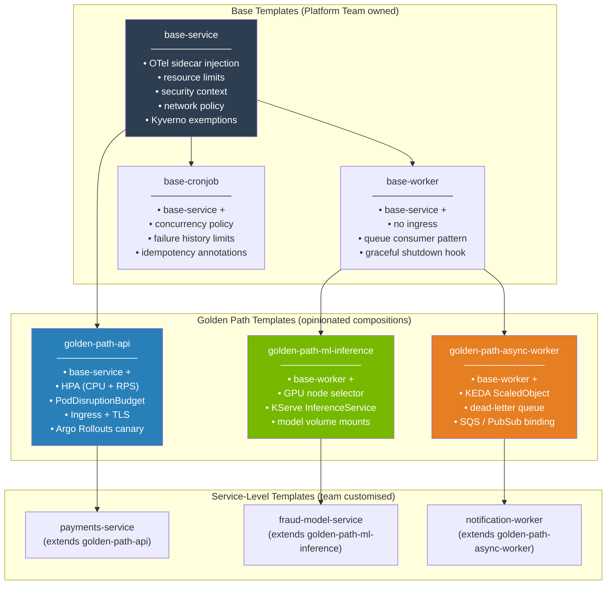
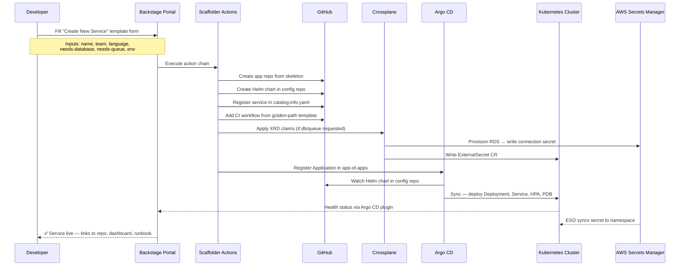
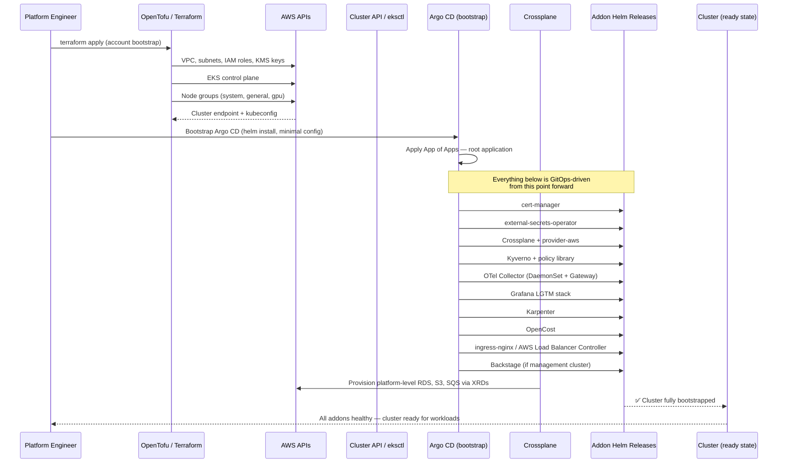
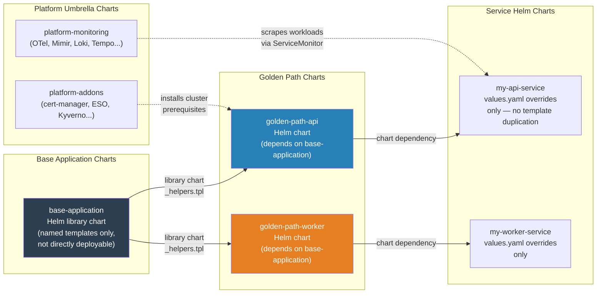

# Platform Templates — Diagrams & Reference Assets

## The Comprehensive Guide to Platform Engineering — 2026 First Edition

---

## Part A — Mermaid Diagrams

---

### A1. Template Inheritance Flow



---

### A2. Golden Path Provisioning (Backstage Scaffolder → Running Service)



---

### A3. Environment Bootstrap Sequence



---

### A4. Helm Chart Template Inheritance (Umbrella → Service)



---

## Part B — Reference Template Assets

---

### B1. `terraform-platform-bootstrap.tf`

**AWS account bootstrap — VPC, EKS, IAM foundations**

```hcl
# terraform-platform-bootstrap.tf
# Platform Engineering Book — Chapter 25 Reference Asset
#
# Bootstraps the foundational AWS infrastructure for a cloud-native IDP:
#   - VPC with public/private/intra subnets
#   - EKS cluster with managed node groups
#   - Karpenter node provisioner IAM
#   - IRSA for core platform addons
#   - KMS key for secrets encryption
#
# Prerequisites:
#   - AWS provider ~> 5.0
#   - terraform ~> 1.7 (or OpenTofu ~> 1.6)
#   - S3 backend configured externally

terraform {
  required_version = ">= 1.6.0"

  required_providers {
    aws = {
      source  = "hashicorp/aws"
      version = "~> 5.40"
    }
    kubernetes = {
      source  = "hashicorp/kubernetes"
      version = "~> 2.27"
    }
    helm = {
      source  = "hashicorp/helm"
      version = "~> 2.13"
    }
  }

  backend "s3" {
    # Configure per environment via -backend-config
    # bucket         = "my-org-tfstate"
    # key            = "platform/bootstrap/terraform.tfstate"
    # region         = "eu-west-1"
    # dynamodb_table = "terraform-state-lock"
    # encrypt        = true
  }
}

# ---------------------------------------------------------------------------
# Variables
# ---------------------------------------------------------------------------

variable "aws_region" {
  description = "AWS region for all resources"
  type        = string
  default     = "eu-west-1"
}

variable "environment" {
  description = "Environment name (production | staging | development)"
  type        = string
  validation {
    condition     = contains(["production", "staging", "development"], var.environment)
    error_message = "Environment must be production, staging, or development."
  }
}

variable "cluster_name" {
  description = "EKS cluster name"
  type        = string
}

variable "cluster_version" {
  description = "Kubernetes version"
  type        = string
  default     = "1.31"
}

variable "vpc_cidr" {
  description = "VPC CIDR block"
  type        = string
  default     = "10.0.0.0/16"
}

variable "tags" {
  description = "Common resource tags"
  type        = map(string)
  default     = {}
}

# ---------------------------------------------------------------------------
# Locals
# ---------------------------------------------------------------------------

locals {
  azs = slice(data.aws_availability_zones.available.names, 0, 3)

  # Subnet CIDR allocation — /19 gives ~8000 IPs per subnet, appropriate
  # for large node pools. Adjust for your addressing scheme.
  private_subnets = [for k, v in local.azs : cidrsubnet(var.vpc_cidr, 3, k)]
  public_subnets  = [for k, v in local.azs : cidrsubnet(var.vpc_cidr, 3, k + 3)]
  intra_subnets   = [for k, v in local.azs : cidrsubnet(var.vpc_cidr, 8, k + 52)]

  common_tags = merge(var.tags, {
    Environment    = var.environment
    ManagedBy      = "terraform"
    Platform       = "idp"
    CostCentre     = "platform-engineering"
  })
}

# ---------------------------------------------------------------------------
# Data Sources
# ---------------------------------------------------------------------------

data "aws_availability_zones" "available" {
  filter {
    name   = "opt-in-status"
    values = ["opt-in-not-required"]
  }
}

data "aws_caller_identity" "current" {}
data "aws_partition" "current" {}

# ---------------------------------------------------------------------------
# KMS — Envelope encryption for EKS secrets
# ---------------------------------------------------------------------------

resource "aws_kms_key" "eks" {
  description             = "EKS cluster secrets encryption — ${var.cluster_name}"
  deletion_window_in_days = 7
  enable_key_rotation     = true

  tags = merge(local.common_tags, {
    Name = "${var.cluster_name}-eks-secrets"
  })
}

resource "aws_kms_alias" "eks" {
  name          = "alias/${var.cluster_name}-eks-secrets"
  target_key_id = aws_kms_key.eks.key_id
}

# ---------------------------------------------------------------------------
# VPC
# ---------------------------------------------------------------------------

module "vpc" {
  source  = "terraform-aws-modules/vpc/aws"
  version = "~> 5.6"

  name = "${var.cluster_name}-vpc"
  cidr = var.vpc_cidr

  azs             = local.azs
  private_subnets = local.private_subnets
  public_subnets  = local.public_subnets
  intra_subnets   = local.intra_subnets

  enable_nat_gateway     = true
  single_nat_gateway     = var.environment != "production"
  one_nat_gateway_per_az = var.environment == "production"

  enable_dns_hostnames = true
  enable_dns_support   = true

  # Required tags for EKS subnet auto-discovery
  public_subnet_tags = {
    "kubernetes.io/role/elb"                    = 1
    "kubernetes.io/cluster/${var.cluster_name}" = "shared"
  }

  private_subnet_tags = {
    "kubernetes.io/role/internal-elb"           = 1
    "kubernetes.io/cluster/${var.cluster_name}" = "shared"
    # Karpenter subnet discovery
    "karpenter.sh/discovery" = var.cluster_name
  }

  tags = local.common_tags
}

# ---------------------------------------------------------------------------
# EKS Cluster
# ---------------------------------------------------------------------------

module "eks" {
  source  = "terraform-aws-modules/eks/aws"
  version = "~> 20.8"

  cluster_name    = var.cluster_name
  cluster_version = var.cluster_version

  vpc_id                   = module.vpc.vpc_id
  subnet_ids               = module.vpc.private_subnets
  control_plane_subnet_ids = module.vpc.intra_subnets

  # Public endpoint restricted to operator CIDRs — adjust for your bastion/VPN
  cluster_endpoint_public_access       = true
  cluster_endpoint_public_access_cidrs = ["0.0.0.0/0"] # Tighten in production

  cluster_addons = {
    coredns = {
      most_recent = true
    }
    kube-proxy = {
      most_recent = true
    }
    vpc-cni = {
      most_recent    = true
      before_compute = true
      configuration_values = jsonencode({
        env = {
          ENABLE_PREFIX_DELEGATION = "true"
          WARM_PREFIX_TARGET       = "1"
        }
      })
    }
    aws-ebs-csi-driver = {
      most_recent              = true
      service_account_role_arn = module.ebs_csi_irsa.iam_role_arn
    }
  }

  # Envelope encryption for Kubernetes secrets
  cluster_encryption_config = {
    provider_key_arn = aws_kms_key.eks.arn
    resources        = ["secrets"]
  }

  # System node group — runs platform-critical addons only
  # Karpenter manages all application workload nodes
  eks_managed_node_groups = {
    system = {
      name           = "${var.cluster_name}-system"
      instance_types = ["m6i.xlarge", "m6a.xlarge"]

      min_size     = 3
      max_size     = 6
      desired_size = 3

      labels = {
        "node.kubernetes.io/purpose" = "system"
      }

      taints = [{
        key    = "CriticalAddonsOnly"
        value  = "true"
        effect = "NO_SCHEDULE"
      }]

      block_device_mappings = {
        xvda = {
          device_name = "/dev/xvda"
          ebs = {
            volume_size           = 100
            volume_type           = "gp3"
            iops                  = 3000
            throughput            = 150
            encrypted             = true
            kms_key_id            = aws_kms_key.eks.arn
            delete_on_termination = true
          }
        }
      }
    }
  }

  # IRSA — enable OIDC for service account token projection
  enable_irsa = true

  tags = local.common_tags
}

# ---------------------------------------------------------------------------
# IRSA — Core Platform Addon Roles
# ---------------------------------------------------------------------------

module "ebs_csi_irsa" {
  source  = "terraform-aws-modules/iam/aws//modules/iam-role-for-service-accounts-eks"
  version = "~> 5.39"

  role_name             = "${var.cluster_name}-ebs-csi"
  attach_ebs_csi_policy = true

  oidc_providers = {
    main = {
      provider_arn               = module.eks.oidc_provider_arn
      namespace_service_accounts = ["kube-system:ebs-csi-controller-sa"]
    }
  }

  tags = local.common_tags
}

module "external_secrets_irsa" {
  source  = "terraform-aws-modules/iam/aws//modules/iam-role-for-service-accounts-eks"
  version = "~> 5.39"

  role_name = "${var.cluster_name}-external-secrets"

  role_policy_arns = {
    policy = aws_iam_policy.external_secrets.arn
  }

  oidc_providers = {
    main = {
      provider_arn               = module.eks.oidc_provider_arn
      namespace_service_accounts = ["external-secrets:external-secrets"]
    }
  }

  tags = local.common_tags
}

resource "aws_iam_policy" "external_secrets" {
  name        = "${var.cluster_name}-external-secrets"
  description = "Allows External Secrets Operator to read from AWS Secrets Manager and SSM"

  policy = jsonencode({
    Version = "2012-10-17"
    Statement = [
      {
        Effect = "Allow"
        Action = [
          "secretsmanager:GetSecretValue",
          "secretsmanager:DescribeSecret",
          "secretsmanager:ListSecretVersionIds"
        ]
        Resource = "arn:${data.aws_partition.current.partition}:secretsmanager:${var.aws_region}:${data.aws_caller_identity.current.account_id}:secret:${var.environment}/*"
      },
      {
        Effect = "Allow"
        Action = [
          "ssm:GetParameter",
          "ssm:GetParameters",
          "ssm:GetParametersByPath"
        ]
        Resource = "arn:${data.aws_partition.current.partition}:ssm:${var.aws_region}:${data.aws_caller_identity.current.account_id}:parameter/${var.environment}/*"
      },
      {
        Effect   = "Allow"
        Action   = ["kms:Decrypt"]
        Resource = aws_kms_key.eks.arn
      }
    ]
  })

  tags = local.common_tags
}

module "karpenter_irsa" {
  source  = "terraform-aws-modules/iam/aws//modules/iam-role-for-service-accounts-eks"
  version = "~> 5.39"

  role_name                          = "${var.cluster_name}-karpenter-controller"
  attach_karpenter_controller_policy = true

  karpenter_controller_cluster_name       = var.cluster_name
  karpenter_controller_node_iam_role_arns = [module.karpenter_node_role.iam_role_arn]

  oidc_providers = {
    main = {
      provider_arn               = module.eks.oidc_provider_arn
      namespace_service_accounts = ["karpenter:karpenter"]
    }
  }

  tags = local.common_tags
}

module "karpenter_node_role" {
  source  = "terraform-aws-modules/iam/aws//modules/iam-role-for-service-accounts-eks"
  version = "~> 5.39"

  role_name = "${var.cluster_name}-karpenter-node"

  role_policy_arns = {
    AmazonEKSWorkerNodePolicy          = "arn:aws:iam::aws:policy/AmazonEKSWorkerNodePolicy"
    AmazonEKS_CNI_Policy               = "arn:aws:iam::aws:policy/AmazonEKS_CNI_Policy"
    AmazonEC2ContainerRegistryReadOnly = "arn:aws:iam::aws:policy/AmazonEC2ContainerRegistryReadOnly"
    AmazonSSMManagedInstanceCore       = "arn:aws:iam::aws:policy/AmazonSSMManagedInstanceCore"
  }

  tags = local.common_tags
}

module "opencost_irsa" {
  source  = "terraform-aws-modules/iam/aws//modules/iam-role-for-service-accounts-eks"
  version = "~> 5.39"

  role_name = "${var.cluster_name}-opencost"

  role_policy_arns = {
    policy = aws_iam_policy.opencost.arn
  }

  oidc_providers = {
    main = {
      provider_arn               = module.eks.oidc_provider_arn
      namespace_service_accounts = ["opencost:opencost"]
    }
  }

  tags = local.common_tags
}

resource "aws_iam_policy" "opencost" {
  name        = "${var.cluster_name}-opencost"
  description = "Allows OpenCost to query AWS Cost & Usage Reports"

  policy = jsonencode({
    Version = "2012-10-17"
    Statement = [
      {
        Effect   = "Allow"
        Action   = ["ce:GetCostAndUsage", "ce:GetUsageForecast"]
        Resource = "*"
      }
    ]
  })

  tags = local.common_tags
}

# ---------------------------------------------------------------------------
# Outputs
# ---------------------------------------------------------------------------

output "cluster_name" {
  description = "EKS cluster name"
  value       = module.eks.cluster_name
}

output "cluster_endpoint" {
  description = "EKS cluster API endpoint"
  value       = module.eks.cluster_endpoint
  sensitive   = true
}

output "cluster_certificate_authority_data" {
  description = "Base64-encoded cluster CA"
  value       = module.eks.cluster_certificate_authority_data
  sensitive   = true
}

output "oidc_provider_arn" {
  description = "OIDC provider ARN for IRSA"
  value       = module.eks.oidc_provider_arn
}

output "karpenter_irsa_role_arn" {
  description = "IAM role ARN for Karpenter controller"
  value       = module.karpenter_irsa.iam_role_arn
}

output "external_secrets_irsa_role_arn" {
  description = "IAM role ARN for External Secrets Operator"
  value       = module.external_secrets_irsa.iam_role_arn
}

output "vpc_id" {
  description = "VPC ID"
  value       = module.vpc.vpc_id
}

output "private_subnet_ids" {
  description = "Private subnet IDs"
  value       = module.vpc.private_subnets
}
```

---

### B2. `kubernetes-service-template.yaml`

**Golden path Helm chart values template for a production API service**

```yaml
# kubernetes-service-template.yaml
# Platform Engineering Book — Chapter 5 / Chapter 25 Reference Asset
#
# This is the canonical values file for the golden-path-api Helm chart.
# Teams copy this, rename it, and override only what differs from the
# platform defaults. They do NOT fork or modify the chart itself.
#
# Chart: oci://registry.internal/platform/golden-path-api:0.9.0
# Rendered with: helm template my-service . -f values.yaml

# ---------------------------------------------------------------------------
# Service Identity
# ---------------------------------------------------------------------------
nameOverride: ""      # defaults to Helm release name
fullnameOverride: ""  # defaults to chart fullname helper

serviceAccount:
  create: true
  # Annotate with IRSA role if the service needs AWS API access
  annotations: {}
  #   eks.amazonaws.com/role-arn: arn:aws:iam::123456789012:role/my-service

# ---------------------------------------------------------------------------
# Container Image
# ---------------------------------------------------------------------------
image:
  repository: 123456789012.dkr.ecr.eu-west-1.amazonaws.com/my-service
  tag: ""           # injected by CI — do not set manually
  pullPolicy: IfNotPresent

imagePullSecrets: []

# ---------------------------------------------------------------------------
# Deployment
# ---------------------------------------------------------------------------
replicaCount: 2      # minimum; HPA takes over in production

# Rollout strategy — golden path uses Argo Rollouts canary by default
# Set to "Recreate" only for stateful singletons
strategy:
  type: RollingUpdate
  rollingUpdate:
    maxSurge: 1
    maxUnavailable: 0

# ---------------------------------------------------------------------------
# Container Configuration
# ---------------------------------------------------------------------------
containerPort: 8080
metricsPort: 9090      # Prometheus scrape port — exposed via ServiceMonitor

# Environment variables — non-sensitive only. Secrets via secretEnvFrom.
env:
  LOG_LEVEL: "info"
  APP_ENV: "production"

# References to Kubernetes Secrets (provisioned by ESO from Secrets Manager)
secretEnvFrom:
  - secretName: my-service-db-credentials
  - secretName: my-service-api-keys

# ConfigMap mounts (non-sensitive config files)
configMapMounts: []
# - name: my-service-config
#   mountPath: /etc/config
#   subPath: config.yaml

# ---------------------------------------------------------------------------
# Resource Limits — Platform enforced minimums via Kyverno
# ---------------------------------------------------------------------------
resources:
  requests:
    cpu: "100m"
    memory: "256Mi"
  limits:
    # CPU limit intentionally omitted — CPU throttling harms latency-sensitive
    # services. Set only if you have a specific containment requirement.
    memory: "512Mi"

# ---------------------------------------------------------------------------
# Security Context — hardened by default, relax only with documented reason
# ---------------------------------------------------------------------------
podSecurityContext:
  runAsNonRoot: true
  runAsUser: 65534       # nobody
  runAsGroup: 65534
  fsGroup: 65534
  seccompProfile:
    type: RuntimeDefault

containerSecurityContext:
  allowPrivilegeEscalation: false
  readOnlyRootFilesystem: true
  capabilities:
    drop:
      - ALL

# ---------------------------------------------------------------------------
# Health Checks
# ---------------------------------------------------------------------------
livenessProbe:
  httpGet:
    path: /healthz
    port: containerPort
  initialDelaySeconds: 10
  periodSeconds: 15
  failureThreshold: 3

readinessProbe:
  httpGet:
    path: /readyz
    port: containerPort
  initialDelaySeconds: 5
  periodSeconds: 10
  failureThreshold: 3

startupProbe:
  httpGet:
    path: /healthz
    port: containerPort
  failureThreshold: 30
  periodSeconds: 5

# ---------------------------------------------------------------------------
# Horizontal Pod Autoscaler
# ---------------------------------------------------------------------------
autoscaling:
  enabled: true
  minReplicas: 2
  maxReplicas: 20
  metrics:
    - type: Resource
      resource:
        name: cpu
        target:
          type: Utilization
          averageUtilization: 70
    - type: Pods
      pods:
        metric:
          name: http_requests_per_second
        target:
          type: AverageValue
          averageValue: "500"
  behavior:
    scaleUp:
      stabilizationWindowSeconds: 60
    scaleDown:
      stabilizationWindowSeconds: 300   # prevent thrashing

# ---------------------------------------------------------------------------
# Pod Disruption Budget — mandatory for production services
# ---------------------------------------------------------------------------
podDisruptionBudget:
  enabled: true
  minAvailable: 1       # or use maxUnavailable: 1

# ---------------------------------------------------------------------------
# Service
# ---------------------------------------------------------------------------
service:
  type: ClusterIP
  port: 80
  targetPort: containerPort

# ---------------------------------------------------------------------------
# Ingress
# ---------------------------------------------------------------------------
ingress:
  enabled: true
  className: nginx
  annotations:
    nginx.ingress.kubernetes.io/ssl-redirect: "true"
    nginx.ingress.kubernetes.io/use-regex: "true"
    cert-manager.io/cluster-issuer: letsencrypt-production
    # Rate limiting — adjust for your service's traffic profile
    nginx.ingress.kubernetes.io/limit-rps: "100"
  hosts:
    - host: my-service.internal.example.com
      paths:
        - path: /
          pathType: Prefix
  tls:
    - secretName: my-service-tls
      hosts:
        - my-service.internal.example.com

# ---------------------------------------------------------------------------
# Argo Rollouts — Canary Delivery (golden path default)
# ---------------------------------------------------------------------------
rollout:
  enabled: true
  canary:
    steps:
      - setWeight: 10
      - pause:
          duration: 5m
      - analysis:
          templates:
            - templateName: success-rate
          args:
            - name: service-name
              value: my-service
      - setWeight: 50
      - pause:
          duration: 5m
      - setWeight: 100
    autoPromotionEnabled: false    # require explicit promotion in production

# ---------------------------------------------------------------------------
# Observability
# ---------------------------------------------------------------------------
serviceMonitor:
  enabled: true
  interval: 30s
  path: /metrics
  port: metricsPort
  labels:
    release: kube-prometheus-stack   # matches Prometheus operator selector

# OpenTelemetry — instrumentation annotation (auto-instrumentation)
podAnnotations:
  instrumentation.opentelemetry.io/inject-java: "false"    # set true for JVM
  instrumentation.opentelemetry.io/inject-nodejs: "false"  # set true for Node
  instrumentation.opentelemetry.io/inject-python: "false"  # set true for Python

# ---------------------------------------------------------------------------
# Affinity and Topology Spread — high availability defaults
# ---------------------------------------------------------------------------
topologySpreadConstraints:
  - maxSkew: 1
    topologyKey: topology.kubernetes.io/zone
    whenUnsatisfiable: DoNotSchedule
    labelSelector:
      matchLabels:
        app.kubernetes.io/name: my-service
  - maxSkew: 1
    topologyKey: kubernetes.io/hostname
    whenUnsatisfiable: DoNotSchedule
    labelSelector:
      matchLabels:
        app.kubernetes.io/name: my-service

affinity:
  podAntiAffinity:
    preferredDuringSchedulingIgnoredDuringExecution:
      - weight: 100
        podAffinityTerm:
          labelSelector:
            matchExpressions:
              - key: app.kubernetes.io/name
                operator: In
                values:
                  - my-service
          topologyKey: kubernetes.io/hostname

# ---------------------------------------------------------------------------
# Karpenter Node Selection — workload scheduling hints
# ---------------------------------------------------------------------------
nodeSelector: {}
# For spot instances:
#   karpenter.sh/capacity-type: spot

tolerations: []
# For GPU nodes:
#   - key: nvidia.com/gpu
#     operator: Exists
#     effect: NoSchedule

# ---------------------------------------------------------------------------
# Platform Labels — used by OpenCost, Backstage, and internal tooling
# ---------------------------------------------------------------------------
commonLabels:
  app.kubernetes.io/part-of: my-domain
  platform.example.com/team: my-team
  platform.example.com/tier: api          # api | worker | cronjob | ml
  platform.example.com/cost-centre: eng   # for showback
```

---

### B3. `github-actions-ci-template.yml`

**Reusable golden path CI pipeline**

```yaml
# github-actions-ci-template.yml
# Platform Engineering Book — Chapter 8 Reference Asset
#
# Reusable workflow — call from your application repo's .github/workflows/ci.yml
# with:
#   uses: my-org/.github/.github/workflows/golden-path-ci.yml@main
#   with:
#     image_name: my-service
#     push_on_branch: main

name: Golden Path CI

on:
  workflow_call:
    inputs:
      image_name:
        description: "OCI image name (without registry prefix)"
        required: true
        type: string
      push_on_branch:
        description: "Branch that triggers image push (default: main)"
        required: false
        type: string
        default: main
      go_version:
        description: "Go toolchain version (if applicable)"
        required: false
        type: string
        default: "1.22"
      node_version:
        description: "Node.js version (if applicable)"
        required: false
        type: string
        default: "22"
      runs_on:
        description: "Runner label"
        required: false
        type: string
        default: ubuntu-latest
      sbom_format:
        description: "SBOM output format: spdx-json | cyclonedx-json"
        required: false
        type: string
        default: spdx-json
    secrets:
      AWS_ROLE_ARN:
        description: "IAM role ARN for OIDC-based ECR push"
        required: true
      COSIGN_PRIVATE_KEY:
        description: "Cosign signing key (KMS reference preferred)"
        required: false
    outputs:
      image_digest:
        description: "Pushed image digest (sha256:...)"
        value: ${{ jobs.build-push.outputs.digest }}
      image_tag:
        description: "Pushed image tag"
        value: ${{ jobs.build-push.outputs.tag }}

env:
  REGISTRY: 123456789012.dkr.ecr.eu-west-1.amazonaws.com
  IMAGE_NAME: ${{ inputs.image_name }}

# ---------------------------------------------------------------------------
# Job: Lint and Static Analysis
# ---------------------------------------------------------------------------
jobs:
  lint:
    name: Lint & Static Analysis
    runs-on: ${{ inputs.runs_on }}
    steps:
      - name: Checkout
        uses: actions/checkout@v4
        with:
          fetch-depth: 0    # required for some linters (e.g. conventional commits)

      - name: Detect language
        id: lang
        run: |
          if [ -f "go.mod" ]; then echo "lang=go" >> $GITHUB_OUTPUT
          elif [ -f "package.json" ]; then echo "lang=node" >> $GITHUB_OUTPUT
          elif [ -f "pyproject.toml" ] || [ -f "requirements.txt" ]; then echo "lang=python" >> $GITHUB_OUTPUT
          else echo "lang=unknown" >> $GITHUB_OUTPUT
          fi

      - name: Set up Go
        if: steps.lang.outputs.lang == 'go'
        uses: actions/setup-go@v5
        with:
          go-version: ${{ inputs.go_version }}
          cache: true

      - name: golangci-lint
        if: steps.lang.outputs.lang == 'go'
        uses: golangci/golangci-lint-action@v6
        with:
          version: v1.57
          args: --timeout 5m

      - name: Set up Node
        if: steps.lang.outputs.lang == 'node'
        uses: actions/setup-node@v4
        with:
          node-version: ${{ inputs.node_version }}
          cache: npm

      - name: ESLint
        if: steps.lang.outputs.lang == 'node'
        run: npm ci && npm run lint

      - name: Dockerfile lint (hadolint)
        uses: hadolint/hadolint-action@v3.1.0
        with:
          dockerfile: Dockerfile
          failure-threshold: warning

  # ---------------------------------------------------------------------------
  # Job: Unit Tests
  # ---------------------------------------------------------------------------
  test:
    name: Unit Tests
    runs-on: ${{ inputs.runs_on }}
    needs: lint
    steps:
      - uses: actions/checkout@v4

      - name: Detect language
        id: lang
        run: |
          if [ -f "go.mod" ]; then echo "lang=go" >> $GITHUB_OUTPUT
          elif [ -f "package.json" ]; then echo "lang=node" >> $GITHUB_OUTPUT
          elif [ -f "pyproject.toml" ] || [ -f "requirements.txt" ]; then echo "lang=python" >> $GITHUB_OUTPUT
          else echo "lang=unknown" >> $GITHUB_OUTPUT
          fi

      - name: Set up Go
        if: steps.lang.outputs.lang == 'go'
        uses: actions/setup-go@v5
        with:
          go-version: ${{ inputs.go_version }}
          cache: true

      - name: Go test with race detector
        if: steps.lang.outputs.lang == 'go'
        run: go test -race -coverprofile=coverage.out ./...

      - name: Node test
        if: steps.lang.outputs.lang == 'node'
        run: npm ci && npm test -- --coverage

      - name: Upload coverage
        uses: codecov/codecov-action@v4
        with:
          files: coverage.out,coverage/lcov.info
          fail_ci_if_error: false

  # ---------------------------------------------------------------------------
  # Job: SAST
  # ---------------------------------------------------------------------------
  sast:
    name: SAST Scan
    runs-on: ${{ inputs.runs_on }}
    needs: lint
    permissions:
      security-events: write    # required to upload SARIF to GitHub
    steps:
      - uses: actions/checkout@v4

      - name: Semgrep scan
        uses: returntocorp/semgrep-action@v1
        with:
          config: >-
            p/security-audit
            p/secrets
            p/owasp-top-ten
          generateSarif: "1"

      - name: Upload SARIF
        uses: github/codeql-action/upload-sarif@v3
        if: always()
        with:
          sarif_file: semgrep.sarif

  # ---------------------------------------------------------------------------
  # Job: Build, Scan, Sign, Push
  # ---------------------------------------------------------------------------
  build-push:
    name: Build, Scan & Sign
    runs-on: ${{ inputs.runs_on }}
    needs: [test, sast]
    permissions:
      id-token: write       # OIDC token for AWS auth + Sigstore keyless signing
      contents: read
      packages: write
      security-events: write
    outputs:
      digest: ${{ steps.push.outputs.digest }}
      tag: ${{ steps.meta.outputs.version }}
    steps:
      - uses: actions/checkout@v4

      - name: Configure AWS credentials (OIDC — no long-lived keys)
        uses: aws-actions/configure-aws-credentials@v4
        with:
          role-to-assume: ${{ secrets.AWS_ROLE_ARN }}
          aws-region: eu-west-1

      - name: Login to Amazon ECR
        id: ecr-login
        uses: aws-actions/amazon-ecr-login@v2

      - name: Set up Docker Buildx
        uses: docker/setup-buildx-action@v3
        with:
          driver-opts: |
            image=moby/buildkit:v0.14.0

      - name: Extract metadata for image
        id: meta
        uses: docker/metadata-action@v5
        with:
          images: ${{ env.REGISTRY }}/${{ env.IMAGE_NAME }}
          tags: |
            type=sha,prefix=,format=short
            type=ref,event=branch
            type=semver,pattern={{version}}
            type=raw,value=latest,enable=${{ github.ref == 'refs/heads/main' }}

      - name: Build image (no push yet)
        id: build
        uses: docker/build-push-action@v6
        with:
          context: .
          platforms: linux/amd64,linux/arm64
          push: false
          load: true
          tags: ${{ steps.meta.outputs.tags }}
          labels: ${{ steps.meta.outputs.labels }}
          cache-from: type=gha
          cache-to: type=gha,mode=max
          provenance: true      # generates SLSA provenance attestation
          sbom: true            # generates SBOM attestation

      - name: Generate SBOM (Syft)
        uses: anchore/sbom-action@v0
        with:
          image: ${{ env.REGISTRY }}/${{ env.IMAGE_NAME }}:${{ steps.meta.outputs.version }}
          format: ${{ inputs.sbom_format }}
          output-file: sbom.json

      - name: Vulnerability scan (Grype)
        id: grype
        uses: anchore/scan-action@v3
        with:
          image: ${{ env.REGISTRY }}/${{ env.IMAGE_NAME }}:${{ steps.meta.outputs.version }}
          fail-build: true
          severity-cutoff: high     # block on HIGH and CRITICAL
          output-format: sarif

      - name: Upload vulnerability SARIF
        uses: github/codeql-action/upload-sarif@v3
        if: always()
        with:
          sarif_file: ${{ steps.grype.outputs.sarif }}

      - name: Push image
        id: push
        uses: docker/build-push-action@v6
        with:
          context: .
          platforms: linux/amd64,linux/arm64
          push: ${{ github.ref == format('refs/heads/{0}', inputs.push_on_branch) }}
          tags: ${{ steps.meta.outputs.tags }}
          labels: ${{ steps.meta.outputs.labels }}
          cache-from: type=gha
          cache-to: type=gha,mode=max
          provenance: true
          sbom: true

      - name: Install Cosign
        if: github.ref == format('refs/heads/{0}', inputs.push_on_branch)
        uses: sigstore/cosign-installer@v3
        with:
          cosign-release: v2.4.0

      - name: Sign image (keyless via Sigstore / Fulcio)
        if: github.ref == format('refs/heads/{0}', inputs.push_on_branch)
        run: |
          cosign sign --yes \
            --rekor-url https://rekor.sigstore.dev \
            ${{ env.REGISTRY }}/${{ env.IMAGE_NAME }}@${{ steps.push.outputs.digest }}

      - name: Attach SBOM attestation
        if: github.ref == format('refs/heads/{0}', inputs.push_on_branch)
        run: |
          cosign attest --yes \
            --type spdxjson \
            --predicate sbom.json \
            ${{ env.REGISTRY }}/${{ env.IMAGE_NAME }}@${{ steps.push.outputs.digest }}

  # ---------------------------------------------------------------------------
  # Job: Update Config Repo (GitOps handoff)
  # ---------------------------------------------------------------------------
  update-config-repo:
    name: Update Config Repo
    runs-on: ${{ inputs.runs_on }}
    needs: build-push
    if: github.ref == format('refs/heads/{0}', inputs.push_on_branch)
    steps:
      - name: Checkout config repo
        uses: actions/checkout@v4
        with:
          repository: my-org/platform-config
          token: ${{ secrets.GITHUB_TOKEN }}   # use a GitHub App token in production
          path: config-repo

      - name: Update image tag in Helm values
        working-directory: config-repo
        run: |
          # Uses yq to precisely update only the image tag
          # Avoids the fragility of sed-based substitution
          yq e -i \
            '.image.tag = "${{ needs.build-push.outputs.image_tag }}"' \
            apps/${{ env.IMAGE_NAME }}/values/production/values.yaml

      - name: Commit and push
        working-directory: config-repo
        run: |
          git config user.name  "platform-ci-bot"
          git config user.email "platform-ci@example.com"
          git add .
          git commit -m "chore(deploy): update ${{ env.IMAGE_NAME }} to ${{ needs.build-push.outputs.image_tag }}

          Digest: ${{ needs.build-push.outputs.image_digest }}
          Source: ${{ github.server_url }}/${{ github.repository }}/commit/${{ github.sha }}"
          git push
```

---

### B4. `crossplane-xrd-database.yaml`

**Composite Resource Definition — self-service PostgreSQL via Crossplane**

```yaml
# crossplane-xrd-database.yaml
# Platform Engineering Book — Chapter 6 Reference Asset
#
# Defines a platform-level abstraction: XPostgresDatabase
# Teams request a database with a simple claim — Crossplane handles
# RDS provisioning, parameter groups, subnet groups, and secret injection.
#
# Apply order:
#   1. xrd-postgres.yaml (this file — CompositeResourceDefinition)
#   2. composition-postgres-rds.yaml (the implementation)
#   3. Per-service: xrc-postgres-claim.yaml (the developer's request)

---
apiVersion: apiextensions.crossplane.io/v1
kind: CompositeResourceDefinition
metadata:
  name: xpostgresdatabases.platform.example.com
spec:
  group: platform.example.com
  names:
    kind: XPostgresDatabase
    plural: xpostgresdatabases
  claimNames:
    kind: PostgresDatabase          # what developers see and request
    plural: postgresdatabases

  versions:
    - name: v1alpha1
      served: true
      referenceable: true
      schema:
        openAPIV3Schema:
          type: object
          properties:
            spec:
              type: object
              properties:
                parameters:
                  type: object
                  required:
                    - instanceClass
                    - storageGB
                    - engineVersion
                  properties:
                    instanceClass:
                      type: string
                      description: "RDS instance class (e.g. db.t4g.micro, db.m6g.large)"
                      enum:
                        - db.t4g.micro
                        - db.t4g.small
                        - db.t4g.medium
                        - db.m6g.large
                        - db.m6g.xlarge
                    storageGB:
                      type: integer
                      description: "Allocated storage in GB"
                      minimum: 20
                      maximum: 1000
                    engineVersion:
                      type: string
                      description: "PostgreSQL engine version"
                      enum:
                        - "16.2"
                        - "15.6"
                      default: "16.2"
                    multiAZ:
                      type: boolean
                      description: "Enable Multi-AZ for production resilience"
                      default: false
                    deletionProtection:
                      type: boolean
                      description: "Prevent accidental deletion"
                      default: true
                    backupRetentionDays:
                      type: integer
                      description: "Automated backup retention (days)"
                      minimum: 1
                      maximum: 35
                      default: 7
                    maintenanceWindow:
                      type: string
                      description: "Weekly maintenance window (UTC)"
                      default: "sun:03:00-sun:04:00"
              required:
                - parameters
            status:
              type: object
              properties:
                endpoint:
                  type: string
                  description: "RDS endpoint hostname"
                port:
                  type: integer
                connectionSecretRef:
                  type: object
                  properties:
                    name:
                      type: string
                    namespace:
                      type: string

---
# Developer claim — what a team puts in their namespace
# crossplane-postgres-claim.yaml
apiVersion: platform.example.com/v1alpha1
kind: PostgresDatabase
metadata:
  name: orders-db
  namespace: orders-service
spec:
  parameters:
    instanceClass: db.t4g.medium
    storageGB: 100
    engineVersion: "16.2"
    multiAZ: true                   # production — always true
    deletionProtection: true
    backupRetentionDays: 14
  # Crossplane writes connection details here
  writeConnectionSecretToRef:
    name: orders-db-credentials
```

---

### B5. `argocd-app-of-apps.yaml`

**Argo CD App of Apps — cluster addon bootstrap**

```yaml
# argocd-app-of-apps.yaml
# Platform Engineering Book — Chapter 8 Reference Asset
#
# The single root Application that Argo CD is bootstrapped with.
# Everything else in the cluster is managed by this tree.
#
# Bootstrap command (run once per cluster):
#   helm upgrade --install argocd argo/argo-cd \
#     --namespace argocd --create-namespace \
#     --set configs.params."server\.insecure"=false
#   kubectl apply -f argocd-app-of-apps.yaml

apiVersion: argoproj.io/v1alpha1
kind: Application
metadata:
  name: platform-root
  namespace: argocd
  finalizers:
    - resources-finalizer.argocd.argoproj.io
  annotations:
    # Prevents Argo CD from deleting the root app itself during sync
    argocd.argoproj.io/sync-wave: "-10"
spec:
  project: platform
  source:
    repoURL: https://github.com/my-org/platform-config.git
    targetRevision: HEAD
    path: clusters/production/apps    # directory of Application manifests

  destination:
    server: https://kubernetes.default.svc
    namespace: argocd

  syncPolicy:
    automated:
      prune: true
      selfHeal: true
    syncOptions:
      - CreateNamespace=true
      - ServerSideApply=true
      - ApplyOutOfSyncOnly=true    # reduces API server load on large clusters

---
# Example child Application — one per platform addon
# clusters/production/apps/external-secrets.yaml
apiVersion: argoproj.io/v1alpha1
kind: Application
metadata:
  name: external-secrets
  namespace: argocd
  annotations:
    argocd.argoproj.io/sync-wave: "1"    # install before addons that depend on it
spec:
  project: platform
  source:
    repoURL: https://charts.external-secrets.io
    chart: external-secrets
    targetRevision: 0.10.3
    helm:
      releaseName: external-secrets
      valuesObject:
        installCRDs: true
        replicaCount: 2
        serviceAccount:
          annotations:
            eks.amazonaws.com/role-arn: "arn:aws:iam::123456789012:role/production-external-secrets"
        metrics:
          service:
            enabled: true
        podDisruptionBudget:
          enabled: true
          minAvailable: 1
  destination:
    server: https://kubernetes.default.svc
    namespace: external-secrets
  syncPolicy:
    automated:
      prune: true
      selfHeal: true
    syncOptions:
      - CreateNamespace=true
      - ServerSideApply=true
```

---

### B6. `kyverno-baseline-policies.yaml`

**Platform baseline policy set — applied to all workload namespaces**

```yaml
# kyverno-baseline-policies.yaml
# Platform Engineering Book — Chapter 15 Reference Asset
#
# ClusterPolicies enforced on every workload namespace.
# Policy mode: Enforce (block non-compliant) for security policies.
#              Audit (report only) for advisory policies.
#
# Deploy via Argo CD — part of the platform-security addon Application.

---
# Policy 1: Require resource limits
apiVersion: kyverno.io/v1
kind: ClusterPolicy
metadata:
  name: require-resource-limits
  annotations:
    policies.kyverno.io/title: Require CPU and Memory Limits
    policies.kyverno.io/severity: medium
    policies.kyverno.io/description: >-
      All containers must declare memory limits to prevent noisy-neighbour
      OOM kills. CPU limits are advisory — this policy audits their absence
      but does not block (CPU throttling tradeoff acknowledged).
spec:
  validationFailureAction: Enforce
  background: true
  rules:
    - name: check-memory-limits
      match:
        any:
          - resources:
              kinds:
                - Pod
              namespaceSelector:
                matchExpressions:
                  - key: platform.example.com/managed
                    operator: In
                    values:
                      - "true"
      exclude:
        any:
          - resources:
              namespaces:
                - kube-system
                - argocd
                - karpenter
                - monitoring
      validate:
        message: "Memory limits are required on all containers. CPU limits are recommended but not enforced."
        pattern:
          spec:
            containers:
              - resources:
                  limits:
                    memory: "?*"

---
# Policy 2: Verify image signatures (Cosign / Sigstore)
apiVersion: kyverno.io/v1
kind: ClusterPolicy
metadata:
  name: verify-image-signatures
  annotations:
    policies.kyverno.io/title: Verify Container Image Signatures
    policies.kyverno.io/severity: high
    policies.kyverno.io/description: >-
      All images from the internal registry must be signed via Cosign
      and have a valid attestation in the Rekor transparency log.
      Third-party images from approved registries are allowed without
      this requirement and must be explicitly listed.
spec:
  validationFailureAction: Enforce
  background: false    # must be false for image verification
  rules:
    - name: verify-internal-image-signature
      match:
        any:
          - resources:
              kinds:
                - Pod
      exclude:
        any:
          - resources:
              namespaces:
                - kube-system
      verifyImages:
        - imageReferences:
            - "123456789012.dkr.ecr.eu-west-1.amazonaws.com/*"
          attestors:
            - count: 1
              entries:
                - keyless:
                    # Keyless signing via Sigstore — verifies Fulcio cert chain
                    subject: "https://github.com/my-org/*"
                    issuer: "https://token.actions.githubusercontent.com"
                    rekor:
                      url: https://rekor.sigstore.dev

---
# Policy 3: Disallow privileged containers
apiVersion: kyverno.io/v1
kind: ClusterPolicy
metadata:
  name: disallow-privileged-containers
  annotations:
    policies.kyverno.io/title: Disallow Privileged Containers
    policies.kyverno.io/severity: high
spec:
  validationFailureAction: Enforce
  background: true
  rules:
    - name: check-privileged
      match:
        any:
          - resources:
              kinds:
                - Pod
      exclude:
        any:
          - resources:
              namespaces:
                - kube-system
                - gpu-operator
      validate:
        message: "Privileged containers are not permitted. Request a platform exception if required."
        pattern:
          spec:
            =(initContainers):
              - =(securityContext):
                  =(privileged): "false"
            containers:
              - =(securityContext):
                  =(privileged): "false"

---
# Policy 4: Require platform labels
apiVersion: kyverno.io/v1
kind: ClusterPolicy
metadata:
  name: require-platform-labels
  annotations:
    policies.kyverno.io/title: Require Platform Cost and Ownership Labels
    policies.kyverno.io/severity: low
spec:
  validationFailureAction: Audit    # advisory — generates report, does not block
  background: true
  rules:
    - name: check-deployment-labels
      match:
        any:
          - resources:
              kinds:
                - Deployment
                - StatefulSet
                - DaemonSet
      validate:
        message: >-
          Deployments must include platform.example.com/team and
          platform.example.com/cost-centre labels for ownership and
          chargeback attribution.
        pattern:
          metadata:
            labels:
              platform.example.com/team: "?*"
              platform.example.com/cost-centre: "?*"

---
# Policy 5: Mutate — inject standard annotations
apiVersion: kyverno.io/v1
kind: ClusterPolicy
metadata:
  name: inject-standard-annotations
  annotations:
    policies.kyverno.io/title: Inject Standard Platform Annotations
spec:
  rules:
    - name: inject-otel-instrumentation
      match:
        any:
          - resources:
              kinds:
                - Pod
              namespaceSelector:
                matchLabels:
                  platform.example.com/otel-auto-instrument: "true"
      mutate:
        patchStrategicMerge:
          metadata:
            annotations:
              +(instrumentation.opentelemetry.io/inject-sdk): "true"
```

---

### B7. `karpenter-nodepool.yaml`

**Karpenter NodePool — general and GPU node classes**

```yaml
# karpenter-nodepool.yaml
# Platform Engineering Book — Chapter 7 Reference Asset
#
# Defines Karpenter NodePools for:
#   - general: standard compute for API services and workers
#   - gpu: GPU nodes for ML inference and training jobs
#
# Karpenter v1.0+ API (NodePool + EC2NodeClass replaces Provisioner)

---
apiVersion: karpenter.sh/v1
kind: NodePool
metadata:
  name: general
spec:
  template:
    metadata:
      labels:
        node.kubernetes.io/purpose: general
        karpenter.sh/nodepool: general
    spec:
      nodeClassRef:
        apiVersion: karpenter.k8s.aws/v1
        kind: EC2NodeClass
        name: general
      requirements:
        - key: karpenter.sh/capacity-type
          operator: In
          values: ["spot", "on-demand"]    # prefer spot; Karpenter falls back
        - key: karpenter.k8s.aws/instance-category
          operator: In
          values: ["c", "m", "r"]
        - key: karpenter.k8s.aws/instance-generation
          operator: Gt
          values: ["5"]
        - key: kubernetes.io/arch
          operator: In
          values: ["amd64", "arm64"]

      # Expiry — forces node replacement on schedule (security patching)
      expireAfter: 720h    # 30 days

  disruption:
    consolidationPolicy: WhenEmptyOrUnderutilized
    consolidateAfter: 30s
    budgets:
      - nodes: "20%"      # never disrupt more than 20% simultaneously

  limits:
    cpu: "1000"
    memory: 4000Gi

---
apiVersion: karpenter.k8s.aws/v1
kind: EC2NodeClass
metadata:
  name: general
spec:
  amiFamily: AL2023
  role: production-karpenter-node    # IAM role for node instances

  subnetSelectorTerms:
    - tags:
        karpenter.sh/discovery: production

  securityGroupSelectorTerms:
    - tags:
        karpenter.sh/discovery: production

  blockDeviceMappings:
    - deviceName: /dev/xvda
      ebs:
        volumeSize: 100Gi
        volumeType: gp3
        iops: 3000
        throughput: 150
        encrypted: true
        deleteOnTermination: true

  metadataOptions:
    httpTokens: required      # enforce IMDSv2
    httpPutResponseHopLimit: 1

  tags:
    ManagedBy: karpenter
    Environment: production

---
# GPU NodePool — for ML training and inference workloads
apiVersion: karpenter.sh/v1
kind: NodePool
metadata:
  name: gpu
spec:
  template:
    metadata:
      labels:
        node.kubernetes.io/purpose: gpu
        karpenter.sh/nodepool: gpu
    spec:
      nodeClassRef:
        apiVersion: karpenter.k8s.aws/v1
        kind: EC2NodeClass
        name: gpu
      requirements:
        - key: karpenter.sh/capacity-type
          operator: In
          values: ["on-demand"]    # GPU spot is available but less reliable
        - key: karpenter.k8s.aws/instance-family
          operator: In
          values: ["g5", "p4d", "p3"]
        - key: kubernetes.io/arch
          operator: In
          values: ["amd64"]
      taints:
        - key: nvidia.com/gpu
          effect: NoSchedule       # only GPU-requesting pods land here
      expireAfter: 336h            # 14 days — shorter cycle for GPU nodes

  disruption:
    consolidationPolicy: WhenEmpty    # do not consolidate active GPU nodes
    budgets:
      - nodes: "10%"

  limits:
    cpu: "320"
    memory: 2000Gi

---
apiVersion: karpenter.k8s.aws/v1
kind: EC2NodeClass
metadata:
  name: gpu
spec:
  amiFamily: AL2023
  role: production-karpenter-node

  subnetSelectorTerms:
    - tags:
        karpenter.sh/discovery: production

  securityGroupSelectorTerms:
    - tags:
        karpenter.sh/discovery: production

  blockDeviceMappings:
    - deviceName: /dev/xvda
      ebs:
        volumeSize: 200Gi    # larger root volume — model weights can be large
        volumeType: gp3
        iops: 6000
        throughput: 250
        encrypted: true
        deleteOnTermination: true

  metadataOptions:
    httpTokens: required
    httpPutResponseHopLimit: 1

  tags:
    ManagedBy: karpenter
    Environment: production
    WorkloadType: gpu
```

---

### B8. `external-secret-template.yaml`

**ExternalSecret — ESO pattern for service secrets**

```yaml
# external-secret-template.yaml
# Platform Engineering Book — Chapter 10 Reference Asset
#
# Pattern: one ExternalSecret per secret namespace/service combination.
# The SecretStore (or ClusterSecretStore) is provisioned by the platform team.
# Teams reference it by name — they do not manage AWS credentials directly.

---
# ClusterSecretStore — created once by platform team per environment
# References the IRSA-annotated service account for ESO
apiVersion: external-secrets.io/v1beta1
kind: ClusterSecretStore
metadata:
  name: aws-secrets-manager-production
spec:
  provider:
    aws:
      service: SecretsManager
      region: eu-west-1
      auth:
        jwt:
          serviceAccountRef:
            name: external-secrets
            namespace: external-secrets

---
# ExternalSecret — placed in the service's namespace by the team
# (or generated by the Backstage scaffolder via Crossplane)
apiVersion: external-secrets.io/v1beta1
kind: ExternalSecret
metadata:
  name: orders-service-db-credentials
  namespace: orders-service
spec:
  refreshInterval: 1h     # poll for rotation — reduce for highly sensitive secrets

  secretStoreRef:
    name: aws-secrets-manager-production
    kind: ClusterSecretStore

  target:
    name: orders-db-credentials    # resulting Kubernetes Secret name
    creationPolicy: Owner          # ESO owns and garbage-collects this Secret
    deletionPolicy: Retain         # retain the K8s Secret if the ExternalSecret is deleted
    template:
      type: Opaque
      # Transform the JSON blob from Secrets Manager into individual keys
      data:
        DB_HOST:     "{{ .host }}"
        DB_PORT:     "{{ .port }}"
        DB_NAME:     "{{ .dbname }}"
        DB_USER:     "{{ .username }}"
        DB_PASSWORD: "{{ .password }}"
        DATABASE_URL: "postgresql://{{ .username }}:{{ .password }}@{{ .host }}:{{ .port }}/{{ .dbname }}?sslmode=require"

  data:
    - secretKey: host
      remoteRef:
        key: production/orders-service/db-credentials
        property: host
    - secretKey: port
      remoteRef:
        key: production/orders-service/db-credentials
        property: port
    - secretKey: dbname
      remoteRef:
        key: production/orders-service/db-credentials
        property: dbname
    - secretKey: username
      remoteRef:
        key: production/orders-service/db-credentials
        property: username
    - secretKey: password
      remoteRef:
        key: production/orders-service/db-credentials
        property: password
```

---

### B9. `otel-collector-config.yaml`

**OpenTelemetry Collector — gateway configuration**

```yaml
# otel-collector-config.yaml
# Platform Engineering Book — Chapter 11 / Chapter 12 Reference Asset
#
# Gateway Collector configuration — receives from DaemonSet agents,
# processes, and exports to Grafana LGTM backends.
# Deployed as a Deployment (3 replicas) with HPA.

apiVersion: opentelemetry.io/v1beta1
kind: OpenTelemetryCollector
metadata:
  name: platform-gateway
  namespace: monitoring
spec:
  mode: Deployment
  replicas: 3

  serviceAccount: otel-collector-gateway    # IRSA-annotated for AWS X-Ray if needed

  autoscaler:
    minReplicas: 3
    maxReplicas: 10
    targetCPUUtilization: 70

  config:
    extensions:
      health_check:
        endpoint: 0.0.0.0:13133
      pprof:
        endpoint: 0.0.0.0:1777

    receivers:
      otlp:
        protocols:
          grpc:
            endpoint: 0.0.0.0:4317
          http:
            endpoint: 0.0.0.0:4318

      # Scrape Prometheus metrics directly (for services not using push)
      prometheus:
        config:
          scrape_configs:
            - job_name: kube-state-metrics
              static_configs:
                - targets: ["kube-state-metrics.monitoring.svc:8080"]
            - job_name: node-exporter
              kubernetes_sd_configs:
                - role: node
              relabel_configs:
                - source_labels: [__address__]
                  regex: "(.*):10250"
                  target_label: __address__
                  replacement: "${1}:9100"

    processors:
      batch:
        timeout: 5s
        send_batch_size: 1000
        send_batch_max_size: 1500

      memory_limiter:
        check_interval: 1s
        limit_mib: 1500
        spike_limit_mib: 400

      # Enrich spans with Kubernetes metadata
      k8sattributes:
        auth_type: serviceAccount
        passthrough: false
        extract:
          metadata:
            - k8s.namespace.name
            - k8s.pod.name
            - k8s.pod.uid
            - k8s.deployment.name
            - k8s.node.name
            - k8s.container.name
          labels:
            - tag_name: app.kubernetes.io/name
              key: app.kubernetes.io/name
            - tag_name: platform.example.com/team
              key: platform.example.com/team
        pod_association:
          - sources:
              - from: resource_attribute
                name: k8s.pod.ip

      # Drop internal/noisy spans before storage
      filter:
        spans:
          exclude:
            match_type: regexp
            attributes:
              - key: http.target
                value: "^/(healthz|readyz|metrics)$"

      resource:
        attributes:
          - action: insert
            key: deployment.environment
            value: production

    exporters:
      # Metrics → Grafana Mimir
      prometheusremotewrite:
        endpoint: http://mimir-distributor.monitoring.svc:9009/api/v1/push
        tls:
          insecure: true    # internal cluster traffic — TLS terminated at LB
        headers:
          X-Scope-OrgID: production

      # Logs → Grafana Loki
      loki:
        endpoint: http://loki-distributor.monitoring.svc:3100/loki/api/v1/push
        default_labels_enabled:
          exporter: true
          job: true
        headers:
          X-Scope-OrgID: production

      # Traces → Grafana Tempo
      otlp/tempo:
        endpoint: tempo-distributor.monitoring.svc:4317
        tls:
          insecure: true
        headers:
          X-Scope-OrgID: production

    service:
      extensions: [health_check, pprof]
      pipelines:
        traces:
          receivers: [otlp]
          processors: [memory_limiter, k8sattributes, filter, batch]
          exporters: [otlp/tempo]
        metrics:
          receivers: [otlp, prometheus]
          processors: [memory_limiter, k8sattributes, resource, batch]
          exporters: [prometheusremotewrite]
        logs:
          receivers: [otlp]
          processors: [memory_limiter, k8sattributes, resource, batch]
          exporters: [loki]
```

---

*All assets are production-grade references. Substitute `my-org`, `example.com`, account IDs, and region values for your environment. Assets are designed to be used together — the CI template produces signed images that the Kyverno policy verifies at admission.*

*One assumption: account ID 123456789012 and region eu-west-1 are used as placeholders throughout — these should be parameterised via Terraform variables or Helm values in real usage, which the templates are structured to support.*
